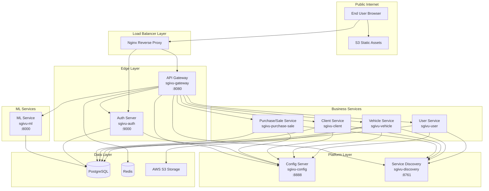
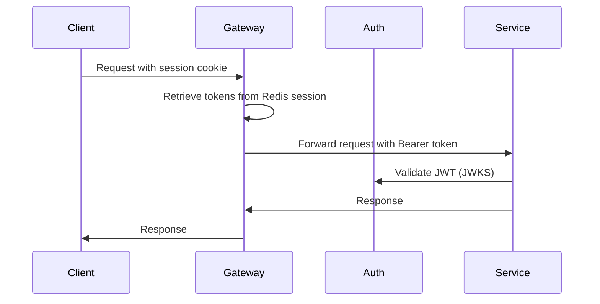
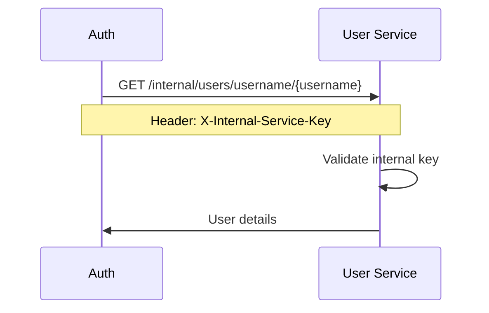

# System Architecture

SGIVU is built on a modern cloud-native microservices architecture leveraging Spring Cloud, service discovery, centralized configuration, and OAuth 2.1/OIDC for security. The platform is designed for horizontal scalability, resilience, and observability.

## Architecture Overview

<Note>
The following diagram illustrates the complete system architecture. You can find detailed diagrams in the source repository at `docs/diagrams/img/`.
</Note>



## Architectural Layers

### 1. Public Layer

**Nginx Reverse Proxy**

Nginx serves as the single public entry point, routing traffic based on URL patterns:

- **Auth Server** (port 9000): `/login`, `/oauth2/*`, `/.well-known/*` — OIDC flows
- **API Gateway** (port 8080): `/v1/*`, `/docs/*`, `/auth/session` — Business APIs and BFF
- **Frontend**: S3 catch-all for Angular SPA

<Info>
This separation allows independent scaling of Auth and Gateway services and simplifies firewall rules (only ports 80/443 exposed).
</Info>

### 2. Edge Layer

#### API Gateway (sgivu-gateway)

**Port**: 8080 | **Technology**: Spring Cloud Gateway (WebFlux)

The gateway implements the **BFF (Backend for Frontend)** pattern and serves multiple roles:

<CardGroup cols={2}>
  <Card title="Authentication Proxy" icon="shield">
    - OAuth2 client for PKCE flow
    - Session management via Redis
    - Token relay to backend services
    - `/auth/session` endpoint for UI
  </Card>
  <Card title="API Gateway" icon="door-open">
    - Route proxying to microservices
    - Circuit breakers (Resilience4j)
    - Global filters (tracing, user ID)
    - Fallback handling
  </Card>
</CardGroup>

**Key Components:**

- **Redis Session Storage**: Enables horizontal scaling without session loss
- **Token Relay Filter**: Automatically forwards OAuth2 tokens to downstream services
- **Circuit Breaker**: Prevents cascading failures with fallback routes
- **Global Filters**:
  - `ZipkinTracingGlobalFilter`: Adds `X-Trace-Id` headers for distributed tracing
  - `AddUserIdHeaderGlobalFilter`: Injects `X-User-ID` from JWT claims

**Route Configuration Example:**

```yaml
spring:
  cloud:
    gateway:
      routes:
        - id: vehicle-service
          uri: lb://sgivu-vehicle
          predicates:
            - Path=/v1/vehicles/**
          filters:
            - TokenRelay=
            - CircuitBreaker=name:vehicleCircuitBreaker,fallbackuri:forward:/fallback/vehicle
```

#### Authorization Server (sgivu-auth)

**Port**: 9000 | **Technology**: Spring Authorization Server

Implements OAuth 2.1 / OpenID Connect with JWT token issuance:

- **Token Types**: Access tokens (JWT), Refresh tokens
- **Flows**: Authorization Code with PKCE
- **Token Signing**: JKS keystore with RS256
- **Storage**: PostgreSQL for clients, authorizations, consents, and sessions
- **User Validation**: Delegates to `sgivu-user` via internal API

**Security Features:**

<Steps>
  <Step title="Client Registration">
    Default clients registered at startup:
    - `sgivu-gateway` (main application)
    - `postman-client` (testing)
    - `oauth2-debugger-client` (debugging)
  </Step>
  <Step title="JWT Claims">
    Tokens include custom claims:
    - `sub`: User ID
    - `username`: User login name
    - `rolesAndPermissions`: Array of permissions
    - `isAdmin`: Boolean flag
  </Step>
  <Step title="Token Validation">
    JWKS endpoint at `/oauth2/jwks` for public key distribution
  </Step>
</Steps>

<Warning>
The keystore file (`keystore.jks`) must be provided via secret manager in production. Default client secrets are for development only.
</Warning>

### 3. Platform Layer

#### Configuration Server (sgivu-config)

**Port**: 8888 | **Technology**: Spring Cloud Config Server

Centralized configuration management supporting two modes:

**Git Mode (Production)**
```yaml
spring:
  cloud:
    config:
      server:
        git:
          uri: https://github.com/stevenrq/sgivu-config-repo.git
          default-label: main
```

**Native Mode (Development)**
```yaml
spring:
  profiles:
    active: native
  cloud:
    config:
      server:
        native:
          search-locations: file:/config-repo
```

**Configuration Repository Structure:**
```
sgivu-config-repo/
├── application.yml              # Global defaults
├── sgivu-gateway.yml
├── sgivu-gateway-dev.yml
├── sgivu-gateway-prod.yml
├── sgivu-auth.yml
├── sgivu-user.yml
├── sgivu-vehicle.yml
├── sgivu-client.yml
└── sgivu-purchase-sale.yml
```

#### Service Discovery (sgivu-discovery)

**Port**: 8761 | **Technology**: Netflix Eureka Server

Provides service registration and discovery:

- **Health Checks**: Periodic heartbeats from registered services
- **Load Balancing**: Client-side load balancing via `LoadBalancerClient`
- **Service Resolution**: Services referenced by `lb://service-name` URIs
- **Dashboard**: Web UI at `http://localhost:8761` for monitoring

**Client Configuration Example:**
```yaml
eureka:
  client:
    service-url:
      defaultZone: http://sgivu-discovery:8761/eureka/
  instance:
    prefer-ip-address: true
    instance-id: ${spring.application.name}:${random.value}
```

### 4. Business Services Layer

#### User Service (sgivu-user)

**Technology**: Spring Boot 4.0.1, Spring Data JPA, PostgreSQL

**Responsibilities:**
- User CRUD with password strength validation
- Role and permission management
- Person entity management
- Internal API for Auth Server (`/internal/users/username/{username}`)

**Database Schema:**
- `users` — User credentials and status
- `persons` — Personal information
- `roles` — Role definitions
- `permissions` — Granular permissions
- `users_roles`, `roles_permissions` — Many-to-many relationships

**Permissions Model:**
```
user:create, user:read, user:update, user:delete
person:create, person:read, person:update, person:delete
role:create, role:read, role:update, role:delete
permission:read
```

#### Vehicle Service (sgivu-vehicle)

**Technology**: Spring Boot 4.0.1, AWS SDK S3

**Responsibilities:**
- Vehicle catalog management (cars, motorcycles)
- Advanced search with multiple criteria
- Status management (available/unavailable)
- Image management via AWS S3 with presigned URLs

**S3 Integration Flow:**

<Steps>
  <Step title="Request Upload URL">
    Client requests presigned URL from backend
    ```bash
    POST /v1/vehicles/{id}/images/upload-url
    ```
  </Step>
  <Step title="Direct Upload to S3">
    Client uploads image directly to S3 using presigned URL
  </Step>
  <Step title="Confirm Upload">
    Client notifies backend to register image metadata
    ```bash
    POST /v1/vehicles/{id}/images/confirm-upload
    ```
  </Step>
</Steps>

**Image Management Features:**
- Supported formats: JPEG, PNG, WebP
- Primary image designation
- Automatic CORS configuration for allowed origins
- Metadata tracking in PostgreSQL

#### Client Service (sgivu-client)

**Technology**: Spring Boot 4.0.1, Spring Data JPA

**Responsibilities:**
- Client management (persons and companies)
- Address management with geographical data
- Advanced search and filtering
- Client counters and statistics

**Entity Model:**
```
clients (abstract)
├── persons (individual clients)
└── companies (corporate clients)
    └── addresses
```

#### Purchase/Sale Service (sgivu-purchase-sale)

**Technology**: Spring Boot 4.0.1, OpenPDF, Apache POI

**Responsibilities:**
- Contract lifecycle management
- Purchase and sale transactions
- Contract status tracking
- Report generation (PDF, Excel, CSV)
- Integration with User, Client, and Vehicle services

**Contract Workflow:**
1. Contract creation with client, user, and vehicle references
2. Status transitions (draft → active → completed/cancelled)
3. Document generation
4. Reporting and analytics

### 5. Machine Learning Layer

#### ML Service (sgivu-ml)

**Port**: 8000 | **Technology**: FastAPI, scikit-learn, Python 3.12

**Responsibilities:**
- Demand forecasting and prediction
- Model training and retraining
- Feature engineering
- Model versioning and persistence

**API Endpoints:**

| Endpoint | Method | Description |
|----------|--------|-------------|
| `/v1/ml/predict` | POST | Request prediction with features |
| `/v1/ml/predict-with-history` | POST | Prediction with historical data for visualization |
| `/v1/ml/retrain` | POST | Trigger model retraining |
| `/v1/ml/models/latest` | GET | Get latest model metadata |
| `/health` | GET | Health check |

**Model Persistence:**
- Artifacts stored via `joblib`
- Optional PostgreSQL storage for model versions
- Training features snapshots
- Prediction logging for monitoring

**Security:**
- JWT validation via OIDC discovery
- Internal service key support (`X-Internal-Service-Key`)
- Token propagation from Gateway

### 6. Data Layer

#### PostgreSQL Databases

Each service has its own database following the **database-per-service** pattern:

```
sgivu_auth_db       — OAuth2 clients, authorizations, sessions
sgivu_user_db       — Users, roles, permissions, persons
sgivu_vehicle_db    — Vehicles, images metadata
sgivu_client_db     — Clients (persons/companies), addresses
sgivu_purchase_sale_db — Purchase/sale contracts
sgivu_ml_db         — ML models, features, predictions
```

**Migration Management:**
- Flyway for versioned schema migrations
- Migrations in `src/main/resources/db/migration/V{version}__{description}.sql`
- Seed data in `R__seed_data.sql` (repeatable)

#### Redis

**Purpose**: HTTP session persistence for `sgivu-gateway`

**Configuration:**
```yaml
spring:
  session:
    store-type: redis
    redis:
      namespace: spring:session:sgivu-gateway
  data:
    redis:
      host: ${REDIS_HOST:sgivu-redis}
      port: ${REDIS_PORT:6379}
      password: ${REDIS_PASSWORD}
```

**Session Cookie:**
- Name: `SESSION`
- Attributes: `HttpOnly`, `SameSite=Lax`, `Path=/`
- Enables horizontal scaling without session loss

<Info>
Redis is used **exclusively** for session storage, not for caching or rate limiting.
</Info>

#### AWS S3

**Purpose**: Vehicle image storage

**Features:**
- Presigned URLs for direct client upload/download
- CORS configuration for allowed origins
- Bucket policies for minimum access
- Image type validation (JPEG, PNG, WebP)

## Communication Patterns

### Synchronous Communication

**REST APIs with OAuth2 Token Relay:**



**Service-to-Service (Internal):**



### Service Discovery

Services communicate using logical names resolved via Eureka:

```java
// Gateway route configuration
uri: lb://sgivu-vehicle  // Resolved to http://<vehicle-instance-ip>:<port>
```

### Circuit Breaking

Resilience4j provides circuit breaker patterns in the Gateway:

```yaml
resilience4j:
  circuitbreaker:
    instances:
      vehicleCircuitBreaker:
        failure-rate-threshold: 50
        wait-duration-in-open-state: 10s
        sliding-window-size: 10
```

## Observability & Monitoring

### Distributed Tracing

**Zipkin Integration:**

- Trace ID propagation via `X-Trace-Id` header
- Span creation at Gateway and service levels
- Trace correlation across service boundaries
- Zipkin UI: `http://localhost:9411`

### Health Checks

**Spring Boot Actuator:**

```bash
GET /actuator/health
```

**FastAPI (ML Service):**

```bash
GET /health
GET /actuator/health
```

### Metrics

Micrometer metrics exposed for Prometheus scraping:
- JVM metrics (memory, threads, GC)
- HTTP request metrics (duration, status codes)
- Custom business metrics

## Deployment Architecture

### Local Development

```bash
cd infra/compose/sgivu-docker-compose
docker compose -f docker-compose.dev.yml up -d
```

### Production (AWS)

<CardGroup cols={2}>
  <Card title="Network" icon="network-wired">
    - VPC with private subnets
    - Application Load Balancer (public)
    - NAT Gateway for outbound
  </Card>
  <Card title="Compute" icon="server">
    - ECS Fargate / EKS for services
    - Auto-scaling groups
    - EC2 for Nginx (optional)
  </Card>
  <Card title="Data" icon="database">
    - RDS PostgreSQL (Multi-AZ)
    - ElastiCache Redis (cluster mode)
    - S3 for static assets & images
  </Card>
  <Card title="Security" icon="lock">
    - Security groups (least privilege)
    - Secrets Manager for credentials
    - WAF on ALB
  </Card>
</CardGroup>

**Network Topology:**

```
Internet
   |
  ALB (public subnets)
   |
   +-- Nginx (EC2)
   |
   +-- API Gateway (private subnets)
   +-- Auth Server (private subnets)
   |
   +-- Business Services (private subnets)
   |
   +-- RDS (private subnets)
   +-- ElastiCache (private subnets)
```

## Build Pipeline

<Note>
Detailed build pipeline diagram available at `docs/diagrams/img/02-build-pipeline.png`
</Note>

**Build Process:**

<Steps>
  <Step title="Maven Build (Java Services)">
    ```bash
    ./mvnw clean package
    ```
  </Step>
  <Step title="Docker Image Build">
    ```bash
    ./build-image.bash
    docker build -t stevenrq/{service}:v1 .
    ```
  </Step>
  <Step title="Push to Registry">
    ```bash
    # Orchestrated build and push
    cd infra/compose/sgivu-docker-compose
    ./build-and-push-images.bash
    ```
  </Step>
  <Step title="Deploy">
    Update service definitions in ECS/EKS with new image tags
  </Step>
</Steps>

## Security Considerations

### Authentication Flow (BFF Pattern)

<Note>
Detailed BFF and refresh token flow diagram: `docs/diagrams/img/03-bff-refresh-token-flow.png`
</Note>

**Authorization Code with PKCE:**

1. User initiates login from Angular app
2. Gateway redirects to Auth Server with PKCE challenge
3. User authenticates
4. Auth Server issues tokens (access + refresh)
5. Gateway stores tokens in Redis-backed session
6. Gateway issues session cookie to client
7. Client includes cookie in subsequent requests
8. Gateway retrieves tokens from session and relays to services

**Token Refresh:**

Gateway automatically refreshes access tokens using refresh token when expired.

### Service-to-Service Authentication

**Internal Service Key:**

```bash
X-Internal-Service-Key: {shared-secret}
```

<Warning>
Never expose the internal service key publicly. Store in environment variables or secret manager.
</Warning>

### Data Protection

- **Encryption in transit**: HTTPS/TLS for all external communication
- **Encryption at rest**: RDS encryption, S3 server-side encryption
- **Secrets management**: AWS Secrets Manager or HashiCorp Vault
- **Database credentials**: Never in code or Git repository

## Troubleshooting

### Common Issues

| Issue | Diagnosis | Solution |
|-------|-----------|----------|
| 401/403 errors | Token validation failure | Verify issuer URL, JWKS endpoint, token claims |
| Service not registered in Eureka | Config Server unreachable | Check `eureka.client.service-url.defaultZone` |
| Session loss after restart | Redis not configured | Verify Redis connection and session config |
| Circuit breaker opens | Downstream service failing | Check service health, logs, and fallback routes |
| Config not loading | Config Server unavailable | Ensure `SPRING_CLOUD_CONFIG_URI` is correct |

### Health Check Commands

```bash
# Gateway
curl http://localhost:8080/actuator/health

# Auth Server
curl http://localhost:9000/actuator/health

# User Service
curl http://localhost:8081/actuator/health

# Eureka Dashboard
open http://localhost:8761

# Config Server
curl http://localhost:8888/actuator/health
curl http://localhost:8888/sgivu-gateway/dev
```

## Version Validation

Ensure consistency across service versions:

```bash
./scripts/check-readme-boot-version.sh
```

This validates that all README files reference the correct Spring Boot version.

## Next Steps

<CardGroup cols={2}>
  <Card title="Features" icon="stars" href="/features">
    Explore detailed feature documentation
  </Card>
  <Card title="API Reference" icon="code" href="/api/auth/oauth2">
    Browse API endpoints and schemas
  </Card>
</CardGroup>
