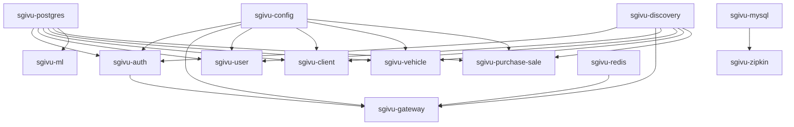

SGIVU uses Docker Compose to orchestrate its microservices architecture. This guide explains the container architecture, networking, dependencies, and deployment strategies.

## Architecture Overview

SGIVU's Docker Compose setup orchestrates multiple services:

- **7 Spring Boot backend services** (auth, gateway, config, discovery, user, client, vehicle, purchase-sale)
- **1 FastAPI ML service**
- **3 databases** (PostgreSQL, MySQL, Redis)
- **1 distributed tracing system** (Zipkin)

### Service Dependency Graph



## Docker Compose Files

SGIVU provides two Docker Compose configurations:

### docker-compose.dev.yml (Development)

- Uses `native` profile for Config Server (loads from local filesystem)
- Mounts local config repository as volume
- Development environment variables from `.env.dev`
- All ports exposed to host for debugging
- Includes Zipkin for distributed tracing

### docker-compose.yml (Production)

- Uses `git` profile for Config Server (loads from Git repository)
- Production environment variables from `.env`
- Only necessary ports exposed
- Optimized for cloud deployment (AWS EC2/ECS)
- Uses managed services where applicable (RDS instead of containers)

## Service Definitions

### Infrastructure Services

#### PostgreSQL Database

```yaml
sgivu-postgres:
  container_name: sgivu-postgres
  image: postgres:16
  ports:
    - "5432:5432"
  networks:
    - sgivu-network
  volumes:
    - postgres-data:/var/lib/postgresql/data
```

**Purpose**: Shared PostgreSQL instance for all backend services. Each service uses a separate database within this instance.

**Databases created**:
- `sgivu_auth_db`
- `sgivu_user_db`
- `sgivu_client_db`
- `sgivu_vehicle_db`
- `sgivu_purchase_sale_db`
- `sgivu_ml_db`

#### MySQL Database (Zipkin Only)

```yaml
sgivu-mysql:
  container_name: sgivu-mysql
  image: mysql:8
  command: --mysql-native-password=ON
  ports:
    - "3306:3306"
  networks:
    - sgivu-network
  volumes:
    - mysql-data:/var/lib/mysql
```

**Purpose**: MySQL is used **exclusively** as storage backend for Zipkin distributed tracing. No other service uses MySQL.

#### Redis

```yaml
sgivu-redis:
  container_name: sgivu-redis
  image: redis:7
  command: redis-server --requirepass "${REDIS_PASSWORD}"
  ports:
    - "6379:6379"
  networks:
    - sgivu-network
  volumes:
    - redis-data:/data
```

**Purpose**: Session storage for `sgivu-gateway` (BFF pattern). Redis enables horizontal scaling of the gateway without losing user sessions.

<Note>
Redis is **only** used by the gateway for HTTP sessions. It's not used for caching, rate limiting, or other purposes.
</Note>

### Core Backend Services

#### Config Server

```yaml
sgivu-config:
  container_name: sgivu-config
  image: stevenrq/sgivu-config:v1
  ports:
    - "8888:8888"
  networks:
    - sgivu-network
  volumes:
    - ../../../../sgivu-config-repo:/config-repo  # Dev only
  environment:
    - SPRING_PROFILES_ACTIVE=native  # or 'git' in prod
```

**Purpose**: Centralized configuration server. All Spring Boot services fetch their configuration from here.

**Startup order**: Must start **before** all other backend services.

#### Discovery Server (Eureka)

```yaml
sgivu-discovery:
  container_name: sgivu-discovery
  image: stevenrq/sgivu-discovery:v1
  ports:
    - "8761:8761"
  networks:
    - sgivu-network
```

**Purpose**: Service registry for dynamic service discovery. The gateway uses Eureka to route requests to backend services.

**Startup order**: Must start **before** gateway and business services.

#### Auth Service

```yaml
sgivu-auth:
  container_name: sgivu-auth
  image: stevenrq/sgivu-auth:v1
  ports:
    - "9000:9000"
  networks:
    - sgivu-network
  depends_on:
    - sgivu-postgres
    - sgivu-config
    - sgivu-discovery
```

**Purpose**: OAuth 2.1 / OIDC authorization server. Issues JWT tokens and manages user authentication.

**Dependencies**:
- PostgreSQL (for user data and OAuth2 clients)
- Config Server (for configuration)
- Eureka (for service registration)

#### Gateway (BFF)

```yaml
sgivu-gateway:
  container_name: sgivu-gateway
  image: stevenrq/sgivu-gateway:v1
  ports:
    - "8080:8080"
  networks:
    - sgivu-network
  depends_on:
    - sgivu-redis
    - sgivu-config
    - sgivu-discovery
    - sgivu-auth
```

**Purpose**: API Gateway implementing the Backend-For-Frontend (BFF) pattern. Routes requests, manages sessions, and stores OAuth2 tokens.

**Dependencies**:
- Redis (for session storage)
- Config Server
- Eureka (for service discovery routing)
- Auth Service (for OAuth2 flow)

### Business Services

#### User Service

```yaml
sgivu-user:
  container_name: sgivu-user
  image: stevenrq/sgivu-user:v1
  ports:
    - "8081:8081"
  networks:
    - sgivu-network
  depends_on:
    - sgivu-postgres
    - sgivu-config
    - sgivu-discovery
```

**Purpose**: User management service.

#### Client Service

```yaml
sgivu-client:
  container_name: sgivu-client
  image: stevenrq/sgivu-client:v1
  ports:
    - "8082:8082"
  networks:
    - sgivu-network
  depends_on:
    - sgivu-postgres
    - sgivu-config
    - sgivu-discovery
```

**Purpose**: Customer/client management service.

#### Vehicle Service

```yaml
sgivu-vehicle:
  container_name: sgivu-vehicle
  image: stevenrq/sgivu-vehicle:v1
  ports:
    - "8083:8083"
  networks:
    - sgivu-network
  depends_on:
    - sgivu-postgres
    - sgivu-config
    - sgivu-discovery
```

**Purpose**: Vehicle inventory management with S3 integration for images.

#### Purchase-Sale Service

```yaml
sgivu-purchase-sale:
  container_name: sgivu-purchase-sale
  image: stevenrq/sgivu-purchase-sale:v1
  ports:
    - "8084:8084"
  networks:
    - sgivu-network
  depends_on:
    - sgivu-postgres
    - sgivu-config
    - sgivu-discovery
```

**Purpose**: Transaction management for vehicle purchases and sales.

### Machine Learning Service

```yaml
sgivu-ml:
  container_name: sgivu-ml
  image: stevenrq/sgivu-ml:v1
  ports:
    - "8000:8000"
  networks:
    - sgivu-network
  depends_on:
    - sgivu-postgres
```

**Purpose**: FastAPI-based ML service for demand forecasting. Does **not** use Config Server (uses Pydantic Settings directly).

### Observability Services

#### Zipkin

```yaml
sgivu-zipkin:
  container_name: sgivu-zipkin
  image: openzipkin/zipkin
  ports:
    - "9411:9411"
  networks:
    - sgivu-network
  depends_on:
    - sgivu-mysql
```

**Purpose**: Distributed tracing for monitoring request flows across microservices.

## Networking

### Docker Network

All services communicate via a custom bridge network:

```yaml
networks:
  sgivu-network:
    driver: bridge
```

Services can reach each other using container names as hostnames:
- `http://sgivu-auth:9000`
- `http://sgivu-gateway:8080`
- `http://sgivu-postgres:5432`

### Port Mappings

| Service | Internal Port | External Port | Purpose |
|---------|---------------|---------------|----------|
| Gateway | 8080 | 8080 | Main API entry point |
| Auth | 9000 | 9000 | OAuth2/OIDC endpoints |
| Config | 8888 | 8888 | Configuration server |
| Discovery | 8761 | 8761 | Eureka dashboard |
| User | 8081 | 8081 | User API |
| Client | 8082 | 8082 | Client API |
| Vehicle | 8083 | 8083 | Vehicle API |
| Purchase-Sale | 8084 | 8084 | Transaction API |
| ML | 8000 | 8000 | ML predictions |
| Zipkin | 9411 | 9411 | Tracing UI |
| PostgreSQL | 5432 | 5432 | Database |
| MySQL | 3306 | 3306 | Zipkin storage |
| Redis | 6379 | 6379 | Session storage |

<Warning>
In production, only expose necessary ports (Gateway: 8080, Auth: 9000). Keep internal services (databases, Eureka, Config) behind a firewall.
</Warning>

## Volumes

Persistent data is stored in Docker volumes:

```yaml
volumes:
  postgres-data:  # PostgreSQL databases
  mysql-data:     # MySQL/Zipkin data
  redis-data:     # Redis sessions
```

To remove all data:

```bash
docker compose -f docker-compose.dev.yml down -v
```

## Running the Stack

### Development Mode

<Steps>

<Step title="Create environment file">

```bash
cd infra/compose/sgivu-docker-compose
cp .env.dev.example .env.dev
```

</Step>

<Step title="Start the stack">

```bash
chmod +x run.bash
./run.bash --dev
```

Or manually:

```bash
docker compose -f docker-compose.dev.yml --env-file .env.dev up -d --build
```

</Step>

<Step title="Monitor startup">

```bash
# Watch all logs
docker compose -f docker-compose.dev.yml logs -f

# Watch specific service
docker compose -f docker-compose.dev.yml logs -f sgivu-gateway

# Check service status
docker compose -f docker-compose.dev.yml ps
```

</Step>

<Step title="Verify services">

```bash
# Eureka dashboard
curl http://localhost:8761

# Gateway health
curl http://localhost:8080/actuator/health

# Auth server
curl http://localhost:9000/.well-known/openid-configuration
```

</Step>

</Steps>

### Production Mode

<Steps>

<Step title="Prepare environment">

```bash
cp .env.example .env
nano .env  # Replace all placeholders
```

Ensure all `your-*-here` placeholders are replaced with real values.

</Step>

<Step title="Validate configuration">

```bash
# Check for placeholder values
grep -r "your-.*-here" .env

# Validate compose file
docker compose config
```

</Step>

<Step title="Start production stack">

```bash
./run.bash --prod
```

Or:

```bash
docker compose up -d --build
```

</Step>

<Step title="Monitor production startup">

```bash
# Check services are healthy
docker compose ps

# Check logs for errors
docker compose logs --tail=100 -f
```

</Step>

</Steps>

## Managing Services

### Individual Service Operations

```bash
# Restart a single service
docker compose -f docker-compose.dev.yml restart sgivu-gateway

# Stop a service
docker compose -f docker-compose.dev.yml stop sgivu-user

# Start a stopped service
docker compose -f docker-compose.dev.yml start sgivu-user

# View logs for specific service
docker compose -f docker-compose.dev.yml logs -f sgivu-auth

# Execute command in service container
docker compose -f docker-compose.dev.yml exec sgivu-postgres psql -U postgres
```

### Rebuild and Restart Service

Use the provided script to rebuild a single service:

```bash
chmod +x rebuild-service.bash
./rebuild-service.bash --dev sgivu-auth
```

This script:
1. Rebuilds the Docker image
2. Pushes to Docker Hub (if configured)
3. Recreates only that container in the running stack

### Health Checks

```bash
# Check all service health
for port in 8080 9000 8888 8761 8081 8082 8083 8084 8000; do
  echo "Port $port:"
  curl -s http://localhost:$port/actuator/health | jq '.status'
done

# Check Eureka registration
curl -s http://localhost:8761/eureka/apps | grep -o '<app>[^<]*' | sed 's/<app>//'
```

## Building Images

SGIVU provides scripts for building and pushing Docker images:

### Build All Images

```bash
cd infra/compose/sgivu-docker-compose
chmod +x build-and-push-images.bash
./build-and-push-images.bash
```

This orchestrator script:
1. Traverses all service directories
2. Runs individual `build-image.bash` scripts
3. Compiles Java projects with Maven when needed
4. Builds Docker images
5. Pushes to Docker Hub registry

### Build Individual Service

```bash
cd apps/backend/sgivu-auth
chmod +x build-image.bash
./build-image.bash
```

### Custom Image Tags

To use custom image tags, edit the `image` field in `docker-compose.yml`:

```yaml
sgivu-auth:
  image: stevenrq/sgivu-auth:v2.0.0  # Change version tag
```

## Production Deployment Strategies

### AWS EC2 Deployment

<Steps>

<Step title="Launch EC2 instance">

- **Instance type**: t3.xlarge or larger
- **OS**: Ubuntu 22.04 LTS or Amazon Linux 2023
- **Storage**: 50GB+ EBS volume
- **Security groups**: Open ports 80, 443, 22 (SSH)

</Step>

<Step title="Install Docker">

```bash
ssh -i key.pem ubuntu@your-ec2-public-ip

# Install Docker
curl -fsSL https://get.docker.com -o get-docker.sh
sudo sh get-docker.sh
sudo usermod -aG docker ubuntu

# Install Docker Compose
sudo curl -L "https://github.com/docker/compose/releases/latest/download/docker-compose-$(uname -s)-$(uname -m)" -o /usr/local/bin/docker-compose
sudo chmod +x /usr/local/bin/docker-compose
```

</Step>

<Step title="Clone and configure">

```bash
git clone https://github.com/your-org/sgivu.git
cd sgivu/infra/compose/sgivu-docker-compose

cp .env.example .env
nano .env  # Configure production values
```

</Step>

<Step title="Start services">

```bash
./run.bash --prod
```

</Step>

<Step title="Configure Nginx reverse proxy">

See the [Installation guide](/getting-started/installation#configure-nginx-production) for Nginx configuration.

</Step>

</Steps>

### AWS ECS Deployment

For container orchestration with ECS:

1. Create ECS cluster
2. Define task definitions for each service
3. Use AWS RDS for databases instead of containers
4. Use ElastiCache Redis for session storage
5. Configure Application Load Balancer
6. Use AWS Secrets Manager for sensitive variables

### Kubernetes Deployment

Convert Docker Compose to Kubernetes manifests:

```bash
# Using Kompose
kompose convert -f docker-compose.yml

# Apply to cluster
kubectl apply -f .
```

Recommended Kubernetes setup:
- Use Helm charts for each service
- External PostgreSQL (Amazon RDS, Azure Database)
- External Redis (ElastiCache, Azure Cache)
- Ingress controller for routing
- Cert-manager for TLS certificates

## Monitoring and Logging

### View Logs

```bash
# All services
docker compose -f docker-compose.dev.yml logs -f

# Specific service
docker compose -f docker-compose.dev.yml logs -f sgivu-gateway

# Last 100 lines
docker compose -f docker-compose.dev.yml logs --tail=100

# Follow with timestamps
docker compose -f docker-compose.dev.yml logs -f -t
```

### Distributed Tracing

Access Zipkin UI:

```bash
open http://localhost:9411
```

View traces across microservices to debug performance issues and track request flows.

### Resource Monitoring

```bash
# Container resource usage
docker stats

# Specific service
docker stats sgivu-gateway

# Disk usage
docker system df
```

## Troubleshooting

### Services Won't Start

**Check dependencies are ready:**

```bash
# Config Server must start first
docker compose -f docker-compose.dev.yml logs sgivu-config
curl http://localhost:8888/actuator/health

# Then Discovery
curl http://localhost:8761

# Then dependent services
docker compose -f docker-compose.dev.yml ps
```

**Check environment variables:**

```bash
# Validate config
docker compose -f docker-compose.dev.yml config

# Check for missing variables
docker compose -f docker-compose.dev.yml config | grep -i "null"
```

### Database Connection Issues

```bash
# Check PostgreSQL is running
docker compose -f docker-compose.dev.yml ps sgivu-postgres

# Test connection
docker compose -f docker-compose.dev.yml exec sgivu-postgres psql -U postgres -c "\l"

# Check logs
docker compose -f docker-compose.dev.yml logs sgivu-postgres
```

### Port Conflicts

```bash
# Find process using port
lsof -i :8080

# Kill process
kill -9 <PID>

# Or change port mapping in docker-compose.yml
```

### Out of Memory

```bash
# Check memory usage
docker stats --no-stream

# Increase Docker memory limit (Docker Desktop)
# Settings → Resources → Memory → 8GB+

# Or reduce services in docker-compose
```

### Network Issues

```bash
# Inspect network
docker network inspect sgivu-network

# Recreate network
docker compose -f docker-compose.dev.yml down
docker network prune
docker compose -f docker-compose.dev.yml up -d
```

### Clean Slate Restart

```bash
# Stop everything
docker compose -f docker-compose.dev.yml down -v

# Remove all SGIVU images
docker images | grep sgivu | awk '{print $3}' | xargs docker rmi -f

# Remove dangling volumes
docker volume prune

# Start fresh
./run.bash --dev
```

## Performance Optimization

### Resource Limits

Add resource limits to prevent any service from consuming too many resources:

```yaml
sgivu-gateway:
  # ... other config
  deploy:
    resources:
      limits:
        cpus: '1'
        memory: 1G
      reservations:
        cpus: '0.5'
        memory: 512M
```

### Scaling Services

Scale individual services horizontally:

```bash
# Scale gateway to 3 instances
docker compose -f docker-compose.dev.yml up -d --scale sgivu-gateway=3
```

<Note>
Scaling requires load balancing. The gateway can scale horizontally because it uses Redis for sessions. Other services need additional configuration for scaling.
</Note>

## Security Best Practices

<Warning>
**Production security checklist:**

- ✅ Don't expose database ports (5432, 3306, 6379) to public internet
- ✅ Use strong passwords for all services
- ✅ Store secrets in AWS Secrets Manager, not `.env` files
- ✅ Only expose Gateway (8080) and Auth (9000) ports publicly
- ✅ Use TLS/HTTPS with valid certificates
- ✅ Enable Docker security scanning
- ✅ Regularly update base images
- ✅ Use non-root users in Dockerfiles
- ✅ Enable Docker Content Trust
- ✅ Implement network policies
</Warning>

## Next Steps

<CardGroup cols={2}>
  <Card title="Configuration Reference" icon="gear" href="/getting-started/configuration">
    Detailed environment variable documentation
  </Card>
  <Card title="Architecture Overview" icon="sitemap" href="/architecture">
    Understand the microservices architecture
  </Card>
  <Card title="API Reference" icon="code" href="/api/auth/oauth2">
    Explore the API documentation
  </Card>
  <Card title="Monitoring" icon="chart-line" href="/infrastructure/monitoring">
    Set up observability and monitoring
  </Card>
</CardGroup>