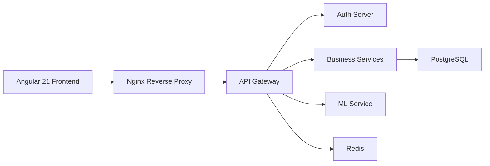

# Welcome to SGIVU

SGIVU is a cloud-native vehicle inventory management SaaS platform designed for automotive dealerships and vehicle sales businesses. Built on a modern microservices architecture, SGIVU provides comprehensive tools for managing vehicles, clients, purchases, sales, and leveraging machine learning for intelligent business insights.

## What is SGIVU?

SGIVU (Sistema de Gestión de Inventario de Vehículos Unidos) is an enterprise-grade platform that centralizes all aspects of vehicle inventory operations:

- **Vehicle Management**: Complete catalog management for cars and motorcycles with advanced search, status tracking, and image management via AWS S3
- **Client Management**: Unified management of individual and corporate clients with detailed profiles and transaction history
- **Purchase & Sales Contracts**: End-to-end contract lifecycle management with reporting capabilities (PDF, Excel, CSV)
- **User & Role Management**: Granular permission system with OAuth 2.1/OIDC authentication
- **Machine Learning**: Predictive analytics for demand forecasting and business intelligence
- **Multi-tenant Ready**: Designed for scalability with centralized configuration and service discovery

## Who is SGIVU For?

<CardGroup cols={2}>
  <Card title="Auto Dealerships" icon="car">
    Manage inventory across multiple locations with real-time tracking and intelligent demand forecasting
  </Card>
  <Card title="Vehicle Sales Businesses" icon="handshake">
    Streamline purchase and sales operations with automated contract generation and reporting
  </Card>
  <Card title="Fleet Managers" icon="truck">
    Track vehicle status, maintenance schedules, and optimize fleet utilization
  </Card>
  <Card title="Enterprise Organizations" icon="building">
    Scale operations with microservices architecture and centralized authentication
  </Card>
</CardGroup>

## Key Capabilities

### Authentication & Security

- **OAuth 2.1 / OpenID Connect** implementation with JWT tokens
- **BFF (Backend for Frontend)** pattern via API Gateway
- Granular **role-based access control** with custom permissions
- Session management with Redis for horizontal scalability
- Service-to-service authentication for internal communication

### Architecture Highlights

<Info>
SGIVU follows cloud-native best practices with:
- **Spring Boot 4.0.1** & **Java 21** for backend services
- **Angular 21** for the frontend SPA
- **FastAPI & Python 3.12** for ML services
- **PostgreSQL** for data persistence
- **Redis** for session storage
- **Docker & Docker Compose** for containerization
</Info>

### Observability

- Health checks via Spring Boot Actuator
- Distributed tracing with **Zipkin**
- Metrics collection with **Micrometer**
- Centralized logging for troubleshooting

## Technology Stack



**Frontend:**
- Angular 21, TypeScript
- Bootstrap 5, Chart.js
- RxJS for reactive programming

**Backend:**
- Spring Boot 4.0.1, Spring Cloud
- Spring Security (OAuth2/OIDC)
- Spring Data JPA
- Flyway (database migrations)

**Machine Learning:**
- FastAPI, Uvicorn
- scikit-learn, XGBoost
- pandas, numpy

**Infrastructure:**
- Docker, Docker Compose
- Nginx reverse proxy
- AWS (S3, EC2/ECS/EKS, RDS, ALB)
- Redis 7

**Observability:**
- Spring Boot Actuator
- Micrometer, Zipkin
- Health checks & metrics

## Quick Start

<Steps>
  <Step title="Clone the Repository">
    ```bash
    git clone https://github.com/stevenrq/sgivu.git
    cd sgivu
    ```
  </Step>
  
  <Step title="Set Up Environment Variables">
    ```bash
    cp infra/compose/sgivu-docker-compose/.env.example .env
    # Edit .env with your configuration
    ```
  </Step>
  
  <Step title="Launch the Complete Stack">
    ```bash
    cd infra/compose/sgivu-docker-compose
    ./run.bash --dev
    ```
  </Step>
  
  <Step title="Access the Application">
    - **Frontend**: http://localhost:4200
    - **API Gateway**: http://localhost:8080
    - **Auth Server**: http://localhost:9000
    - **Service Discovery**: http://localhost:8761
    - **ML Service**: http://localhost:8000
  </Step>
</Steps>

<Note>
The development environment uses Docker Compose with mounted volumes for hot-reloading during development.
</Note>

## Main Endpoints

| Service | Port | Endpoint | Description |
|---------|------|----------|-------------|
| Frontend | 4200 | `http://localhost:4200` | Angular SPA |
| Gateway | 8080 | `http://localhost:8080` | API Gateway (BFF) |
| Auth | 9000 | `http://localhost:9000` | OAuth2/OIDC Server |
| Config | 8888 | `http://localhost:8888` | Centralized Configuration |
| Discovery | 8761 | `http://localhost:8761` | Eureka Service Registry |
| ML | 8000 | `http://localhost:8000` | Machine Learning API |
| Zipkin | 9411 | `http://localhost:9411` | Distributed Tracing (optional) |

## Next Steps

<CardGroup cols={2}>
  <Card title="Architecture" icon="sitemap" href="/architecture">
    Dive deep into the microservices architecture and communication patterns
  </Card>
  <Card title="Features" icon="stars" href="/features">
    Explore comprehensive feature documentation
  </Card>
</CardGroup>

<Warning>
**Security Notice**: Default credentials and secrets are provided for development only. Never use default secrets in production environments. Move all secrets to a secret manager (AWS Secrets Manager, HashiCorp Vault, etc.).
</Warning>
