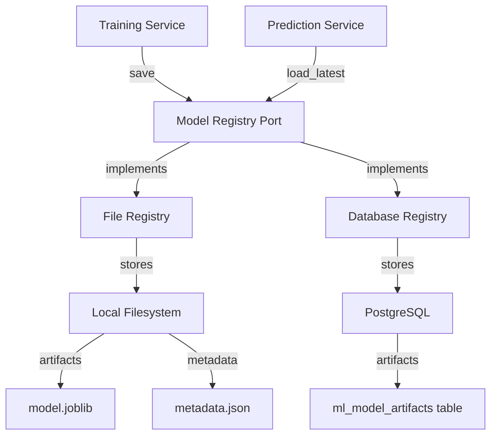
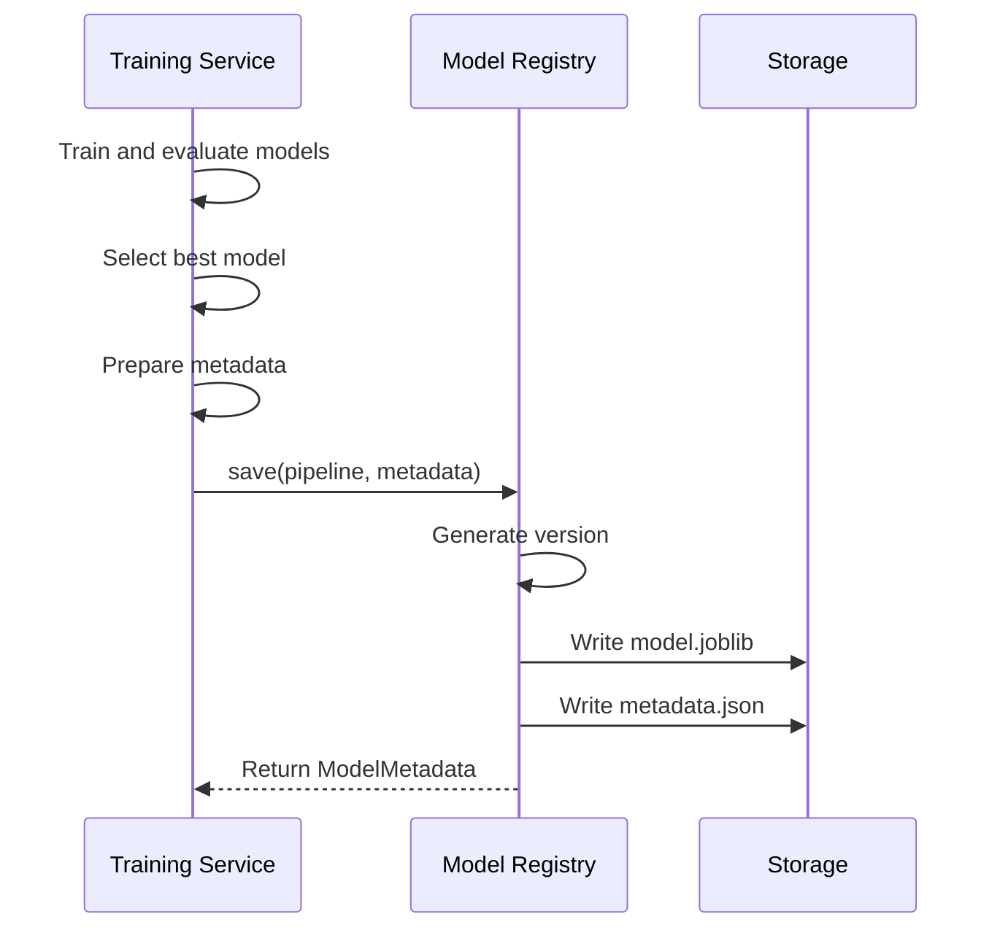
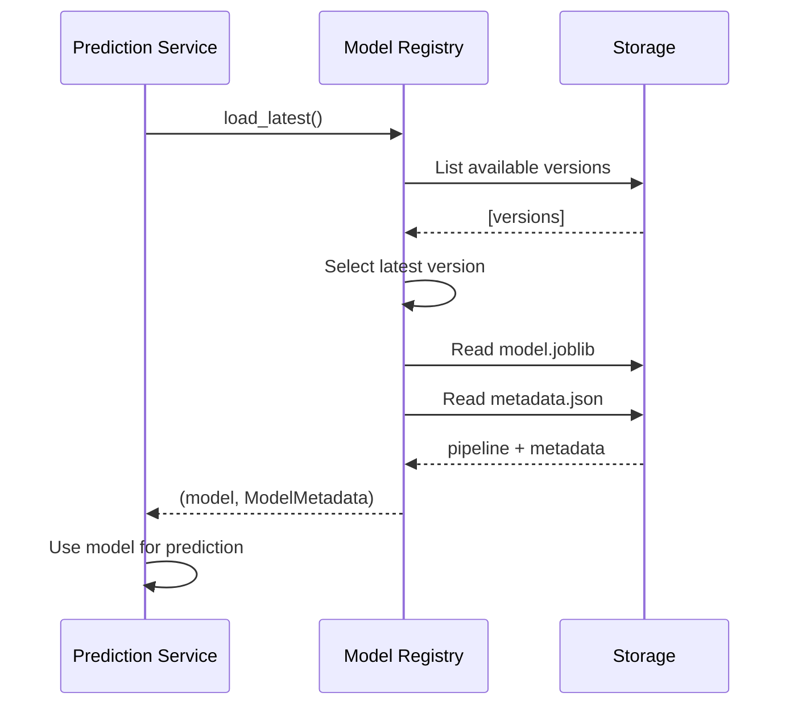

## Overview

The SGIVU ML service implements a robust model management system that handles versioning, persistence, metadata tracking, and model lifecycle operations. This ensures reproducibility, traceability, and seamless model updates.

## Model Registry

The **Model Registry** is the central component for managing ML artifacts, implemented through the `ModelRegistryPort` interface with concrete implementations for file system and database storage.

### Architecture



<Info>
The service can operate in **file-only mode** (no database) or **database-backed mode** for enterprise deployments with centralized storage.
</Info>

---

## Model Versioning

### Version Format

Models are versioned using timestamp-based identifiers:

```
YYYYMMDD_HHMMSS
```

**Example**: `20260306_143022` represents a model trained on March 6, 2026 at 14:30:22.

### Why Timestamp Versioning?

<CardGroup cols={2}>
  <Card title="Chronological Ordering" icon="clock">
    Versions are naturally sorted by training time
  </Card>
  <Card title="No Conflicts" icon="shield-check">
    Concurrent training jobs won't collide (down to second precision)
  </Card>
  <Card title="Reproducibility" icon="rotate">
    Easy to identify when a model was created
  </Card>
  <Card title="Simplicity" icon="circle-check">
    No need for separate version number management
  </Card>
</CardGroup>

### Version Generation

Versions are automatically generated during model save:

```python
from datetime import datetime, timezone

def generate_version() -> str:
    """Generate timestamp-based version identifier"""
    return datetime.now(timezone.utc).strftime("%Y%m%d_%H%M%S")

# Example usage
version = generate_version()  # "20260306_143022"
```

---

## Model Persistence

### File-Based Storage

When using file system storage (configured via `MODEL_DIR`):

```
MODEL_DIR/
├── 20260301_093045/
│   ├── model.joblib      # Serialized sklearn pipeline
│   └── metadata.json     # Training metadata
├── 20260305_141530/
│   ├── model.joblib
│   └── metadata.json
└── 20260306_143022/      # Latest version
    ├── model.joblib
    └── metadata.json
```

#### Model Artifact (model.joblib)

The trained sklearn `Pipeline` object serialized with joblib:

```python
import joblib

# Save
joblib.dump(pipeline, "model.joblib")

# Load
pipeline = joblib.load("model.joblib")
```

The pipeline includes:
- **Preprocessor**: `ColumnTransformer` with encoders and scalers
- **Model**: Best estimator (LinearRegression, RandomForest, or XGBoost)

#### Metadata File (metadata.json)

```json
{
  "version": "20260306_143022",
  "trained_at": "2026-03-06T14:30:22.123456+00:00",
  "target": "sales_count",
  "features": [
    "vehicle_type",
    "brand",
    "model",
    "line",
    "purchases_count",
    "avg_margin",
    "avg_sale_price",
    "avg_purchase_price",
    "avg_days_inventory",
    "inventory_rotation",
    "lag_1",
    "lag_3",
    "lag_6",
    "rolling_mean_3",
    "rolling_mean_6",
    "month",
    "year",
    "month_sin",
    "month_cos"
  ],
  "metrics": {
    "rmse": 3.24,
    "mae": 2.15,
    "mape": 0.087,
    "r2": 0.89,
    "residual_std": 2.8
  },
  "candidates": [
    {
      "model": "linear_regression",
      "rmse": 4.12,
      "mae": 3.05,
      "mape": 0.124,
      "r2": 0.76,
      "samples": 462
    },
    {
      "model": "random_forest",
      "rmse": 3.45,
      "mae": 2.31,
      "mape": 0.095,
      "r2": 0.85,
      "samples": 462
    },
    {
      "model": "xgboost",
      "rmse": 3.24,
      "mae": 2.15,
      "mape": 0.087,
      "r2": 0.89,
      "samples": 462
    }
  ],
  "train_samples": 1847,
  "test_samples": 462,
  "total_samples": 2309
}
```

<Accordion title="Metadata Field Descriptions">
  <ParamField path="version" type="string">
    Unique model identifier (timestamp-based)
  </ParamField>
  
  <ParamField path="trained_at" type="string">
    ISO 8601 timestamp with timezone
  </ParamField>
  
  <ParamField path="target" type="string">
    Name of the target variable (usually `sales_count`)
  </ParamField>
  
  <ParamField path="features" type="array">
    List of feature names in the order expected by the model
  </ParamField>
  
  <ParamField path="metrics" type="object">
    Performance metrics from test set evaluation
    - `rmse`: Root Mean Squared Error
    - `mae`: Mean Absolute Error
    - `mape`: Mean Absolute Percentage Error
    - `r2`: R-squared score
    - `residual_std`: Used for prediction intervals
  </ParamField>
  
  <ParamField path="candidates" type="array">
    Comparison of all evaluated models with their metrics
  </ParamField>
  
  <ParamField path="train_samples" type="integer">
    Number of samples used for training
  </ParamField>
  
  <ParamField path="test_samples" type="integer">
    Number of samples used for evaluation
  </ParamField>
  
  <ParamField path="total_samples" type="integer">
    Total dataset size
  </ParamField>
</Accordion>

### Database Storage

For production deployments, models can be stored in PostgreSQL:

#### Schema

```sql
CREATE TABLE ml_model_artifacts (
    id SERIAL PRIMARY KEY,
    version VARCHAR(50) UNIQUE NOT NULL,
    trained_at TIMESTAMP WITH TIME ZONE NOT NULL,
    metadata JSONB NOT NULL,
    artifact BYTEA NOT NULL,  -- Serialized model pipeline
    created_at TIMESTAMP WITH TIME ZONE DEFAULT NOW()
);

CREATE INDEX idx_ml_model_version ON ml_model_artifacts(version);
CREATE INDEX idx_ml_model_trained_at ON ml_model_artifacts(trained_at DESC);
```

#### Benefits of Database Storage

<CardGroup cols={2}>
  <Card title="Centralized Storage" icon="database">
    Single source of truth for all model versions
  </Card>
  <Card title="Easy Querying" icon="magnifying-glass">
    SQL queries for model comparison and analysis
  </Card>
  <Card title="Automatic Backups" icon="floppy-disk">
    Models included in database backup strategy
  </Card>
  <Card title="Scalability" icon="chart-line">
    Handle large model collections without filesystem concerns
  </Card>
</CardGroup>

---

## Model Lifecycle

### Training and Registration

When a new model is trained:



**Code Flow** (from `app/application/services/training_service.py:88-94`):

```python
metadata_dict = {
    "trained_at": datetime.now(timezone.utc).isoformat(),
    "target": self._settings.target_column,
    "features": [
        *self._feature_engineering.category_cols,
        *self._feature_engineering.numeric_cols
    ],
    "metrics": {
        **evaluation.metrics,
        "residual_std": evaluation.residual_std,
    },
    "candidates": evaluation.candidates,
    "train_samples": evaluation.train_samples,
    "test_samples": evaluation.test_samples,
    "total_samples": len(dataset),
}

saved = await self._registry.save(evaluation.pipeline, metadata_dict)
logger.info("Model trained and versioned: %s", saved.version)
```

### Loading for Prediction

When making predictions:



**Code** (from `app/application/services/prediction_service.py:177-181`):

```python
async def _load_model(self) -> tuple[Any, ModelMetadata]:
    try:
        return await self._registry.load_latest()
    except FileNotFoundError as exc:
        raise ModelNotTrainedError("Aún no existe un modelo entrenado.") from exc
```

### Model Replacement

<Note>
The service always uses the **latest model** by version. Older versions are retained for auditing but not used for predictions unless explicitly loaded.
</Note>

When a new model is trained:

1. **Old model**: Remains in storage with its version
2. **New model**: Saved with newer version timestamp
3. **Predictions**: Automatically switch to new model on next request

**No downtime** or service restart required. The next prediction request will load the new model.

---

## Feature Snapshots

For reproducibility, the service can persist feature datasets alongside models.

### Purpose

Feature snapshots enable:
- **Prediction without raw data**: Use pre-computed features
- **Faster inference**: No need to rebuild features from transactions
- **Reproducibility**: Ensure predictions use exact training feature distributions
- **Debugging**: Compare features across model versions

### Database Schema

```sql
CREATE TABLE ml_training_features (
    id SERIAL PRIMARY KEY,
    model_version VARCHAR(50) NOT NULL,
    features JSONB NOT NULL,  -- Serialized feature DataFrame
    created_at TIMESTAMP WITH TIME ZONE DEFAULT NOW()
);

CREATE INDEX idx_ml_features_version ON ml_training_features(model_version);
```

### Usage

Features are automatically saved during training (if `feature_repository` is configured):

```python
# From app/application/services/training_service.py:90-91

if self._feature_repository:
    await self._feature_repository.save_snapshot(saved.version, dataset)
```

And loaded during prediction if available:

```python
# From app/application/services/prediction_service.py:210-216

if self._feature_repository:
    history = await self._feature_repository.load_segment_history(
        model_version, segment.model_dump()
    )
    if not history.empty:
        return history
```

<Warning>
Feature snapshots can consume significant database space for large datasets. Consider retention policies or compression for long-term storage.
</Warning>

---

## Prediction Logging

The service can log all prediction requests and responses for:
- **Auditing**: Track who requested what predictions
- **Monitoring**: Detect usage patterns and anomalies
- **Model evaluation**: Compare predictions to actual outcomes
- **Debugging**: Investigate prediction issues

### Database Schema

```sql
CREATE TABLE ml_predictions (
    id SERIAL PRIMARY KEY,
    model_version VARCHAR(50) NOT NULL,
    request_payload JSONB NOT NULL,
    response_payload JSONB NOT NULL,
    segment JSONB NOT NULL,  -- vehicle_type, brand, model, line
    horizon INTEGER NOT NULL,
    confidence FLOAT NOT NULL,
    with_history BOOLEAN NOT NULL,
    created_at TIMESTAMP WITH TIME ZONE DEFAULT NOW()
);

CREATE INDEX idx_ml_predictions_version ON ml_predictions(model_version);
CREATE INDEX idx_ml_predictions_segment ON ml_predictions USING gin(segment);
CREATE INDEX idx_ml_predictions_created_at ON ml_predictions(created_at DESC);
```

### Logged Information

```json
{
  "model_version": "20260306_143022",
  "request_payload": {
    "vehicle_type": "CAR",
    "brand": "TOYOTA",
    "model": "COROLLA",
    "line": "XEI 2.0",
    "horizon_months": 6,
    "confidence": 0.95
  },
  "response_payload": {
    "predictions": [
      {"month": "2026-04-01", "demand": 45.3, "lower_ci": 38.1, "upper_ci": 52.5},
      {"month": "2026-05-01", "demand": 47.8, "lower_ci": 40.2, "upper_ci": 55.4}
    ],
    "model_version": "20260306_143022",
    "metrics": {...}
  },
  "segment": {
    "vehicle_type": "CAR",
    "brand": "TOYOTA",
    "model": "COROLLA",
    "line": "XEI 2.0"
  },
  "horizon": 6,
  "confidence": 0.95,
  "with_history": false,
  "created_at": "2026-03-07T10:15:30.123456+00:00"
}
```

### Querying Prediction Logs

<CodeGroup>
```sql Recent Predictions
-- Get last 100 predictions
SELECT 
    created_at,
    model_version,
    segment->>'brand' as brand,
    segment->>'model' as model,
    horizon,
    response_payload->'predictions'->0->>'demand' as first_month_demand
FROM ml_predictions
ORDER BY created_at DESC
LIMIT 100;
```

```sql Predictions by Segment
-- Find all predictions for a specific segment
SELECT *
FROM ml_predictions
WHERE segment @> '{"brand": "TOYOTA", "model": "COROLLA"}'::jsonb
ORDER BY created_at DESC;
```

```sql Model Usage Statistics
-- Count predictions per model version
SELECT 
    model_version,
    COUNT(*) as prediction_count,
    MIN(created_at) as first_used,
    MAX(created_at) as last_used
FROM ml_predictions
GROUP BY model_version
ORDER BY first_used DESC;
```
</CodeGroup>

---

## Model Comparison

Compare performance across model versions to track improvements:

### Via API

```bash
curl https://api.sgivu.com/v1/ml/models/latest \
  -H "Authorization: Bearer YOUR_TOKEN"
```

Response includes `candidates` field showing all evaluated models:

```json
{
  "version": "20260306_143022",
  "metrics": {
    "rmse": 3.24,
    "mae": 2.15,
    "r2": 0.89
  },
  "candidates": [
    {"model": "linear_regression", "rmse": 4.12, "r2": 0.76},
    {"model": "random_forest", "rmse": 3.45, "r2": 0.85},
    {"model": "xgboost", "rmse": 3.24, "r2": 0.89}
  ]
}
```

### Via Database

```sql
-- Compare latest 5 model versions
SELECT 
    version,
    trained_at,
    metadata->>'metrics'->>'rmse' as rmse,
    metadata->>'metrics'->>'r2' as r2,
    metadata->>'total_samples' as samples
FROM ml_model_artifacts
ORDER BY trained_at DESC
LIMIT 5;
```

### Visualization Example

```python
import pandas as pd
import matplotlib.pyplot as plt

# Fetch model history
versions = [
    {"version": "20260301_093045", "rmse": 4.2, "r2": 0.82},
    {"version": "20260305_141530", "rmse": 3.8, "r2": 0.85},
    {"version": "20260306_143022", "rmse": 3.24, "r2": 0.89},
]

df = pd.DataFrame(versions)

fig, (ax1, ax2) = plt.subplots(1, 2, figsize=(12, 4))

# RMSE over time
ax1.plot(df["version"], df["rmse"], marker="o")
ax1.set_title("RMSE Trend")
ax1.set_ylabel("RMSE")
ax1.tick_params(axis="x", rotation=45)

# R² over time
ax2.plot(df["version"], df["r2"], marker="o", color="green")
ax2.set_title("R² Trend")
ax2.set_ylabel("R² Score")
ax2.tick_params(axis="x", rotation=45)

plt.tight_layout()
plt.show()
```

---

## Model Rollback

If a new model performs poorly in production, you can rollback by:

### Option 1: Filesystem Rollback

Rename directory to make an older version "latest":

```bash
# Temporarily move problematic version
mv MODEL_DIR/20260306_143022 MODEL_DIR/20260306_143022.backup

# Predictions will now use 20260305_141530
```

<Warning>
This is a manual process. Test thoroughly and consider implementing a proper rollback mechanism for production.
</Warning>

### Option 2: Explicit Version Loading

Modify the registry to load a specific version instead of latest:

```python
# Custom implementation (not in current codebase)

class VersionedModelRegistry(ModelRegistryPort):
    def __init__(self, model_dir: Path, preferred_version: str | None = None):
        self.model_dir = model_dir
        self.preferred_version = preferred_version
    
    async def load_latest(self) -> tuple[Any, ModelMetadata]:
        if self.preferred_version:
            return await self.load_version(self.preferred_version)
        # Otherwise use actual latest
        return await super().load_latest()
```

Set via environment variable:

```bash
PREFERRED_MODEL_VERSION=20260305_141530
```

### Option 3: Retrain with Better Data

The best solution is usually to retrain with corrected data:

```bash
curl -X POST https://api.sgivu.com/v1/ml/retrain \
  -H "Authorization: Bearer YOUR_TOKEN" \
  -d '{}'
```

---

## Monitoring and Observability

### Health Checks

Verify model availability:

```bash
curl https://api.sgivu.com/v1/ml/models/latest \
  -H "Authorization: Bearer YOUR_TOKEN"
```

Expected response:
- **200 OK**: Model is available
- **500 Error** with `"No hay modelos disponibles"`: No trained model

### Metrics to Track

<AccordionGroup>
  <Accordion title="Model Performance Metrics">
    - **RMSE**: Track over time, alert if > threshold
    - **R²**: Should be > 0.70 for good models
    - **MAPE**: Percentage error, aim for < 15%
  </Accordion>
  
  <Accordion title="Operational Metrics">
    - **Training frequency**: How often are models retrained?
    - **Training duration**: Is it increasing over time?
    - **Model size**: Disk/memory usage per version
    - **Prediction latency**: Response time for forecasts
  </Accordion>
  
  <Accordion title="Business Metrics">
    - **Prediction accuracy**: Compare forecasts to actuals
    - **Coverage**: % of segments with sufficient training data
    - **Usage**: Predictions per segment/day
    - **Confidence**: Are predictions consistently within CI bounds?
  </Accordion>
</AccordionGroup>

### Alerting

Set up alerts for:

```yaml
alerts:
  - name: NoModelAvailable
    condition: latest_model_age > 7 days
    action: Trigger retraining
  
  - name: ModelPerformanceDegraded
    condition: rmse > 5.0 OR r2 < 0.70
    action: Review data quality, retrain
  
  - name: PredictionErrors
    condition: error_rate > 5%
    action: Check for missing segments, data issues
```

---

## Best Practices

<Card title="Version Retention Policy" icon="trash">
  **Keep**: Last 10 versions or 90 days of models
  
  **Archive**: Older versions to cold storage
  
  **Delete**: Models older than 1 year (after compliance review)
</Card>

<Card title="Model Documentation" icon="file-lines">
  Store additional documentation with each version:
  - Training notebook/script
  - Data quality report
  - Feature importance analysis
  - Business context (e.g., "trained after holiday season")
</Card>

<Card title="A/B Testing" icon="flask">
  For major model changes, run A/B tests:
  - Route 10% of traffic to new model
  - Compare predictions and user feedback
  - Gradually increase traffic if successful
</Card>

<Card title="Reproducibility" icon="code-branch">
  Ensure models can be recreated:
  - Pin dependency versions (`requirements.txt`)
  - Store feature engineering code version
  - Save random seeds in metadata
  - Document hyperparameters
</Card>

---

## API Reference

For API operations related to model management, see:

<CardGroup cols={2}>
  <Card title="Get Latest Model" icon="download" href="/ml/prediction-api#get-latest-model">
    Retrieve current model metadata
  </Card>
  <Card title="Retrain Model" icon="arrows-rotate" href="/ml/prediction-api#retrain-model">
    Trigger new model training
  </Card>
</CardGroup>

---

## Troubleshooting

<AccordionGroup>
  <Accordion title="Model not found error">
    **Error**: `ModelNotTrainedError: Aún no existe un modelo entrenado.`
    
    **Cause**: No model versions exist in `MODEL_DIR` or database.
    
    **Solution**:
    1. Run initial training via `/v1/ml/retrain`
    2. Check `MODEL_DIR` path is correct
    3. Verify database connectivity if using DB storage
  </Accordion>
  
  <Accordion title="Model deserialization errors">
    **Error**: `ValueError: unsupported pickle protocol` or module import errors
    
    **Cause**: Model was trained with different Python/library versions.
    
    **Solution**:
    - Ensure consistent environment (use Docker)
    - Pin dependency versions
    - Retrain model in current environment
  </Accordion>
  
  <Accordion title="Predictions differ after retrain">
    **Cause**: Different training data, features, or model selection.
    
    **Expected behavior**: Models evolve as data changes.
    
    **To investigate**:
    - Compare `candidates` field in metadata
    - Check if different algorithm was selected
    - Review training data date ranges
    - Compare feature distributions
  </Accordion>
  
  <Accordion title="Slow model loading">
    **Cause**: Large model files or network latency (DB storage).
    
    **Solutions**:
    - Cache loaded model in memory (current implementation loads on each prediction)
    - Use file storage instead of DB for faster access
    - Implement model preloading during service startup
  </Accordion>
</AccordionGroup>

---

## Next Steps

<CardGroup cols={2}>
  <Card title="Training Process" icon="graduation-cap" href="/ml/training">
    Learn how models are trained
  </Card>
  <Card title="Prediction API" icon="chart-line" href="/ml/prediction-api">
    Use models for forecasting
  </Card>
  <Card title="Deployment Guide" icon="rocket" href="/infrastructure/deployment">
    Deploy SGIVU to production
  </Card>
  <Card title="Monitoring Guide" icon="chart-mixed" href="/infrastructure/monitoring">
    Set up model monitoring
  </Card>
</CardGroup>