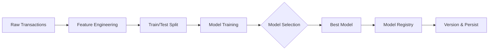

## Overview

The SGIVU ML training pipeline transforms raw transaction data into accurate demand forecasting models. The process involves feature engineering, model training with multiple algorithms, evaluation, and versioning.

## Pipeline Architecture



## Feature Engineering

The feature engineering pipeline is implemented in `app/infrastructure/ml/feature_engineering.py` and transforms raw transaction data into ML-ready features.

### Input Data Requirements

Raw transaction data must include:

<ParamField body="vehicle_id" type="string" required>
  Unique identifier for tracking vehicle lifecycle
</ParamField>

<ParamField body="vehicle_type" type="string" required>
  Vehicle category (CAR, MOTORCYCLE)
</ParamField>

<ParamField body="brand" type="string" required>
  Vehicle manufacturer
</ParamField>

<ParamField body="model" type="string" required>
  Vehicle model name
</ParamField>

<ParamField body="line" type="string" required>
  Specific trim/version - **cannot be empty**
</ParamField>

<ParamField body="contract_type" type="string" required>
  Transaction type: `SALE` or `PURCHASE`
</ParamField>

<ParamField body="sale_price" type="float">
  Sale transaction price
</ParamField>

<ParamField body="purchase_price" type="float">
  Purchase transaction price
</ParamField>

<ParamField body="created_at" type="datetime" required>
  Record creation timestamp
</ParamField>

<ParamField body="updated_at" type="datetime">
  Record update timestamp
</ParamField>

### Data Normalization

Before feature engineering, all categorical data is normalized:

<CodeGroup>
```python Normalization Example
from app.infrastructure.ml.normalization import (
    canonicalize_label,
    canonicalize_brand_model
)

# Label normalization
vehicle_type = canonicalize_label("car")  # → "CAR"
line = canonicalize_label(" xei 2.0 ")    # → "XEI 2.0"

# Brand/model canonicalization
brand, model = canonicalize_brand_model("toyota", "corolla")
# → ("TOYOTA", "COROLLA")
```

```python Source Code Reference
# app/infrastructure/ml/feature_engineering.py:63-78

for col in self.category_cols + self.optional_category_cols:
    if col in work_df:
        work_df[col] = work_df[col].fillna("UNKNOWN").apply(canonicalize_label)

if "brand" in work_df and "model" in work_df:
    pairs = work_df[["brand", "model"]].apply(
        lambda row: canonicalize_brand_model(row["brand"], row["model"]),
        axis=1,
        result_type="expand",
    )
    work_df[["brand", "model"]] = pairs.values
```
</CodeGroup>

<Note>
Normalization ensures consistent segmentation by handling case variations, typos, and whitespace differences.
</Note>

### Feature Categories

The pipeline generates three types of features:

#### 1. Categorical Features

Segmentation dimensions that identify the vehicle:

```python
category_cols = [
    "vehicle_type",  # CAR, MOTORCYCLE
    "brand",         # TOYOTA, HONDA, FORD, etc.
    "model",         # COROLLA, CIVIC, F-150, etc.
    "line"           # Trim/version (mandatory)
]
```

These are encoded using **OneHotEncoder** during model training.

#### 2. Business Metrics

Aggregated monthly metrics per segment:

```python
# app/infrastructure/ml/feature_engineering.py:105-117

monthly = (
    work_df.groupby(group_cols)
    .agg(
        sales_count=("is_sale", "sum"),              # Target variable
        purchases_count=("is_purchase", "sum"),      # Inventory additions
        avg_sale_price=("sale_price", "mean"),       # Average sale price
        avg_purchase_price=("purchase_price", "mean"),# Average cost
        avg_margin=("margin", "mean"),                # Profit margin
        avg_days_inventory=("days_in_inventory", "mean") # Time to sell
    )
    .reset_index()
)

# Inventory rotation: sales / purchases
monthly["inventory_rotation"] = monthly["sales_count"] / monthly[
    "purchases_count"
].clip(lower=1)
```

**Business Feature Descriptions:**

| Feature | Description | Business Insight |
|---------|-------------|------------------|
| `purchases_count` | New inventory acquisitions per month | Supply side activity |
| `avg_margin` | Average profit per sale | Profitability indicator |
| `avg_sale_price` | Mean selling price | Price point trends |
| `avg_purchase_price` | Mean acquisition cost | Cost trends |
| `avg_days_inventory` | Average days from purchase to sale | Inventory velocity |
| `inventory_rotation` | Sales-to-purchase ratio | Turnover efficiency |

#### 3. Time-Series Features

Lagged values and rolling statistics capture temporal patterns:

```python
# app/infrastructure/ml/feature_engineering.py:197-209

def _add_lags(self, group: pd.DataFrame) -> pd.DataFrame:
    """Agrega columnas de lag y medias móviles al grupo."""
    group = group.sort_values("event_month")
    group["lag_1"] = group["sales_count"].shift(1)   # Last month
    group["lag_3"] = group["sales_count"].shift(3)   # 3 months ago
    group["lag_6"] = group["sales_count"].shift(6)   # 6 months ago
    
    # Rolling averages
    group["rolling_mean_3"] = (
        group["sales_count"].rolling(window=3, min_periods=1).mean().shift(1)
    )
    group["rolling_mean_6"] = (
        group["sales_count"].rolling(window=6, min_periods=1).mean().shift(1)
    )
    return group
```

**Time-Series Feature Descriptions:**

| Feature | Window | Purpose |
|---------|--------|----------|
| `lag_1` | 1 month | Recent trend signal |
| `lag_3` | 3 months | Quarterly pattern |
| `lag_6` | 6 months | Semi-annual seasonality |
| `rolling_mean_3` | 3-month average | Short-term smoothing |
| `rolling_mean_6` | 6-month average | Long-term trend |

<Warning>
Lags are calculated **per segment** to avoid leakage across different vehicle types/brands/models.
</Warning>

#### 4. Temporal Features

Cyclical encoding captures seasonality:

```python
# app/infrastructure/ml/feature_engineering.py:211-217

def _add_time_features(self, df: pd.DataFrame) -> pd.DataFrame:
    """Agrega features temporales (mes, año, representación cíclica)."""
    df["month"] = pd.DatetimeIndex(df["event_month"]).month
    df["year"] = pd.DatetimeIndex(df["event_month"]).year
    
    # Cyclical encoding for seasonality
    df["month_sin"] = np.sin(2 * np.pi * df["month"] / 12)
    df["month_cos"] = np.cos(2 * np.pi * df["month"] / 12)
    return df
```

**Why Cyclical Encoding?**

<Info>
Using `sin` and `cos` ensures that December (12) and January (1) are recognized as adjacent months, capturing year-end seasonality patterns.
</Info>

### Feature Engineering Output

The `build_feature_table` method produces a monthly aggregated dataset:

```python
# Example output structure

   vehicle_type    brand     model      line  event_month  sales_count  purchases_count  ...
0           CAR  TOYOTA   COROLLA  XEI 2.0   2025-01-01         42.0             38.0  ...
1           CAR  TOYOTA   COROLLA  XEI 2.0   2025-02-01         38.0             35.0  ...
2           CAR  TOYOTA   COROLLA  XEI 2.0   2025-03-01         44.0             40.0  ...
```

This table contains one row per segment per month with all engineered features.

---

## Model Training

The training process is orchestrated by the `TrainingService` (`app/application/services/training_service.py:46-94`).

### Training Workflow

```python
# Simplified training flow

async def train(self, raw_df: pd.DataFrame) -> ModelMetadata:
    # 1. Feature engineering
    dataset = self._feature_engineering.build_feature_table(raw_df)
    
    # 2. Validate dataset
    if dataset.empty:
        raise TrainingError("No hay datos históricos para entrenar.")
    
    # 3. Train and evaluate models
    evaluation = await asyncio.to_thread(
        self._model_trainer.train_and_evaluate,
        dataset,
        self._feature_engineering.category_cols,
        self._feature_engineering.optional_category_cols,
        self._feature_engineering.numeric_cols,
    )
    
    # 4. Save best model and metadata
    metadata_dict = {
        "trained_at": datetime.now(timezone.utc).isoformat(),
        "target": self._settings.target_column,
        "features": [...],
        "metrics": evaluation.metrics,
        "candidates": evaluation.candidates,
        "train_samples": evaluation.train_samples,
        "test_samples": evaluation.test_samples,
        "total_samples": len(dataset),
    }
    
    saved = await self._registry.save(evaluation.pipeline, metadata_dict)
    return saved
```

### Train/Test Split

The split respects temporal ordering to prevent data leakage:

```python
# app/infrastructure/ml/model_training.py:147-164

def _split_by_time(self, df: pd.DataFrame) -> tuple[pd.DataFrame, pd.DataFrame]:
    """Divide en train/test respetando el orden temporal del historial."""
    unique_months = sorted(df["event_month"].unique())
    
    # Require minimum history (default: 6 months)
    if len(unique_months) < self._settings.min_history_months:
        raise ValueError(
            f"Se requieren al menos {self._settings.min_history_months} meses "
            f"para entrenar."
        )
    
    # 80/20 split by time
    cutoff_index = int(len(unique_months) * 0.8)
    cutoff_date = unique_months[max(1, cutoff_index - 1)]
    
    train = df[df["event_month"] <= cutoff_date]
    test = df[df["event_month"] > cutoff_date]
    
    return train, test
```

<Info>
**Example**: With 12 months of data:
- **Training set**: First 9-10 months
- **Test set**: Last 2-3 months

This simulates real forecasting where you predict future months based on historical data.
</Info>

### Preprocessing Pipeline

Before model fitting, data passes through sklearn preprocessing:

```python
# app/infrastructure/ml/model_training.py:166-186

@staticmethod
def _build_preprocessor(
    category_cols: list[str],
    optional_cols: list[str],
    numeric_cols: list[str],
) -> ColumnTransformer:
    """Construye el ColumnTransformer con encoding categórico y escalado numérico."""
    
    # One-hot encoding for categories
    categorical = OneHotEncoder(handle_unknown="ignore")
    
    # Imputation + standardization for numerics
    numeric = Pipeline(
        steps=[
            ("imputer", SimpleImputer(strategy="median")),
            ("scaler", StandardScaler()),
        ]
    )
    
    return ColumnTransformer(
        transformers=[
            ("categorical", categorical, category_cols + optional_cols),
            ("numeric", numeric, numeric_cols),
        ],
        remainder="drop",
    )
```

**Preprocessing Steps:**

1. **Categorical variables**: One-hot encoded (creates binary columns per category)
2. **Numeric variables**: 
   - Missing values imputed with median
   - Standardized to zero mean and unit variance

### Model Candidates

Three algorithms are evaluated:

<Tabs>
  <Tab title="Linear Regression">
    ```python
    LinearRegression()
    ```
    
    **Pros:**
    - Fast training and prediction
    - Interpretable coefficients
    - Good baseline performance
    
    **Cons:**
    - Assumes linear relationships
    - Limited expressiveness for complex patterns
  </Tab>
  
  <Tab title="Random Forest">
    ```python
    RandomForestRegressor(
        n_estimators=300,
        max_depth=15,
        random_state=7
    )
    ```
    
    **Pros:**
    - Handles non-linear relationships
    - Robust to outliers
    - Feature importance insights
    
    **Cons:**
    - Slower than linear models
    - Can overfit with shallow trees
  </Tab>
  
  <Tab title="XGBoost">
    ```python
    XGBRegressor(
        n_estimators=500,
        max_depth=6,
        learning_rate=0.05,
        subsample=0.9,
        colsample_bytree=0.9,
        objective="reg:squarederror",
        random_state=7
    )
    ```
    
    **Pros:**
    - State-of-the-art performance
    - Handles complex interactions
    - Regularization prevents overfitting
    
    **Cons:**
    - Requires more tuning
    - Longer training time
    - Less interpretable
  </Tab>
</Tabs>

### Model Evaluation

All candidates are evaluated on the test set:

```python
# app/infrastructure/ml/model_training.py:96-128

for name, estimator in candidates_list:
    pipeline = Pipeline(
        steps=[("preprocess", preprocessor), ("model", estimator)],
        memory=None,
    )
    pipeline.fit(x_train, y_train)
    preds = np.asarray(pipeline.predict(x_test))
    
    # Calculate metrics
    rmse = np.sqrt(mean_squared_error(y_test, preds))
    mae = mean_absolute_error(y_test, preds)
    mape = mean_absolute_percentage_error(y_test, preds)
    r2 = r2_score(y_test, preds)
    
    evaluated.append({
        "model": name,
        "rmse": rmse,
        "mae": mae,
        "mape": mape,
        "r2": r2,
        "samples": len(y_test)
    })
    
    # Track best model by RMSE
    if rmse < best_rmse:
        best_rmse = rmse
        best_model = pipeline
        best_metrics = {"rmse": rmse, "mae": mae, "mape": mape, "r2": r2}
```

**Evaluation Metrics:**

<AccordionGroup>
  <Accordion title="RMSE (Root Mean Squared Error)">
    Penalizes large errors more heavily. Same units as target variable.
    
    ```
    RMSE = √(Σ(predicted - actual)² / n)
    ```
    
    **Lower is better**. Primary metric for model selection.
  </Accordion>
  
  <Accordion title="MAE (Mean Absolute Error)">
    Average absolute difference between predictions and actuals.
    
    ```
    MAE = Σ|predicted - actual| / n
    ```
    
    **Lower is better**. More interpretable than RMSE.
  </Accordion>
  
  <Accordion title="MAPE (Mean Absolute Percentage Error)">
    Percentage error, scale-independent.
    
    ```
    MAPE = Σ|predicted - actual| / |actual| / n
    ```
    
    **Lower is better**. Example: 0.087 = 8.7% average error.
  </Accordion>
  
  <Accordion title="R² (Coefficient of Determination)">
    Proportion of variance explained by the model.
    
    ```
    R² = 1 - (SS_residual / SS_total)
    ```
    
    **Closer to 1.0 is better**. 0.89 = model explains 89% of variance.
  </Accordion>
  
  <Accordion title="Residual Std Dev">
    Standard deviation of prediction errors. Used for confidence intervals.
    
    ```python
    residuals = y_test - predictions
    residual_std = np.std(residuals)
    ```
    
    Used to calculate upper/lower bounds in predictions.
  </Accordion>
</AccordionGroup>

### Model Selection and Refit

After evaluation, the best model is retrained on the **full dataset**:

```python
# app/infrastructure/ml/model_training.py:130-144

# Select best model by RMSE
assert best_model is not None

# Refit on complete dataset for production use
final_model = best_model.fit(dataset[feature_cols], dataset["sales_count"])

# Calculate residual statistics for confidence intervals
residuals = y_test - best_predictions if best_predictions is not None else []
residual_std = float(np.std(residuals)) if len(residuals) else 1.0

return TrainingEvaluation(
    pipeline=final_model,
    metrics=best_metrics,
    residual_std=residual_std,
    candidates=evaluated,
    train_samples=len(train_df),
    test_samples=len(test_df),
)
```

<Note>
Refitting on the full dataset gives the model access to all available information for production predictions.
</Note>

---

## Prediction Generation

Once trained, the model generates multi-horizon forecasts iteratively.

### Iterative Forecasting

The `_forecast` method in `PredictionService` (app/application/services/prediction_service.py:266-307):

```python
def _forecast(
    self,
    model: Any,
    metadata: ModelMetadata,
    history: pd.DataFrame,
    horizon: int,
    confidence: float,
) -> List[Dict[str, Any]]:
    """Genera pronóstico iterativo mes a mes usando el modelo entrenado."""
    residual_std = (metadata.metrics or {}).get("residual_std", 1.0)
    z_value = self._z_value(confidence)  # Z-score for confidence level
    
    working_history = history.copy()
    target_month = working_history["event_month"].max()
    results = []
    
    for _ in range(horizon):
        # 1. Advance to next month
        target_month = target_month + pd.offsets.MonthBegin(1)
        
        # 2. Build feature row for next month
        future_row = fe.build_future_row(working_history, target_month)
        features = future_row[fe.category_cols + fe.numeric_cols]
        
        # 3. Predict demand
        prediction = float(model.predict(features)[0])
        
        # 4. Calculate confidence intervals
        lower = max(0.0, prediction - z_value * residual_std)
        upper = max(lower, prediction + z_value * residual_std)
        
        results.append({
            "month": target_month.date().isoformat(),
            "demand": prediction,
            "lower_ci": lower,
            "upper_ci": upper,
        })
        
        # 5. Append prediction to history for next iteration
        appended = future_row.copy()
        appended["sales_count"] = prediction
        working_history = pd.concat([working_history, appended], ignore_index=True)
    
    return results
```

### Future Feature Construction

The `build_future_row` method creates features for months beyond the training data:

```python
# app/infrastructure/ml/feature_engineering.py:142-195

def build_future_row(
    self, history: pd.DataFrame, target_month: pd.Timestamp
) -> pd.DataFrame:
    """Construye una fila de features para un mes futuro basándose en el historial."""
    
    history = history.sort_values("event_month")
    recent = history.tail(3)  # Last 3 months
    
    # Use recent averages for business metrics
    template = {
        "event_month": target_month,
        "purchases_count": float(recent["purchases_count"].mean()),
        "avg_margin": float(recent["avg_margin"].mean()),
        "avg_sale_price": float(recent["avg_sale_price"].mean()),
        "avg_purchase_price": float(recent["avg_purchase_price"].mean()),
        "avg_days_inventory": float(recent["avg_days_inventory"].mean()),
        "inventory_rotation": float(recent["inventory_rotation"].mean()),
        "sales_count": float(history["sales_count"].iloc[-1]),  # Last month
    }
    
    # Carry forward categorical values
    for col in self.category_cols:
        template[col] = history[col].iloc[-1]
    
    # Append to history and recalculate lags
    future_history = pd.concat([history, pd.DataFrame([template])], ignore_index=True)
    future_history = self._add_lags(future_history)  # Recalculate lag features
    future_history = self._add_time_features(future_history)  # Add temporal features
    
    # Extract the future row
    future_row = future_history[future_history["event_month"] == target_month].tail(1)
    return future_row
```

<Info>
**Key Insight**: Future predictions use recent historical averages for business metrics (prices, margins) and automatically update lag features as new predictions are made.
</Info>

### Confidence Intervals

Confidence bounds are calculated using normal distribution assumptions:

```python
# app/application/services/prediction_service.py:309-321

@staticmethod
def _z_value(confidence: float) -> float:
    """Valor z para un nivel de confianza dado (lookup simplificado)."""
    conf = min(max(confidence, 0.5), 0.99)
    if conf >= 0.99:
        return 2.58
    if conf >= 0.95:
        return 1.96
    if conf >= 0.90:
        return 1.64
    if conf >= 0.80:
        return 1.28
    return 1.0
```

**Z-score Mapping:**

| Confidence Level | Z-score | Interpretation |
|------------------|---------|----------------|
| 80% | 1.28 | ±1.28σ contains 80% of values |
| 90% | 1.64 | ±1.64σ contains 90% of values |
| 95% | 1.96 | ±1.96σ contains 95% of values |
| 99% | 2.58 | ±2.58σ contains 99% of values |

**Interval Calculation:**

```
lower_ci = max(0, prediction - z * residual_std)
upper_ci = prediction + z * residual_std
```

The `max(0, ...)` ensures demand predictions never go negative.

---

## Training via API

### Triggering Retraining

Retraining can be triggered programmatically:

<CodeGroup>
```bash cURL
curl -X POST https://api.sgivu.com/v1/ml/retrain \
  -H "Authorization: Bearer YOUR_TOKEN" \
  -H "Content-Type: application/json" \
  -d '{
    "start_date": "2024-01-01",
    "end_date": "2026-03-06"
  }'
```

```python Python Client
import httpx
from datetime import date, timedelta

async def retrain_model(token: str):
    """Retrain model with last 2 years of data"""
    end_date = date.today()
    start_date = end_date - timedelta(days=730)
    
    async with httpx.AsyncClient(timeout=300.0) as client:
        response = await client.post(
            "https://api.sgivu.com/v1/ml/retrain",
            headers={"Authorization": f"Bearer {token}"},
            json={
                "start_date": start_date.isoformat(),
                "end_date": end_date.isoformat()
            }
        )
        response.raise_for_status()
        result = response.json()
    
    print(f"✓ New model version: {result['version']}")
    print(f"  RMSE: {result['metrics']['rmse']:.2f}")
    print(f"  R²: {result['metrics']['r2']:.3f}")
    print(f"  Samples: {result['samples']['total']}")
    
    return result
```

```javascript JavaScript
async function retrainModel(token) {
  const endDate = new Date();
  const startDate = new Date(endDate);
  startDate.setFullYear(startDate.getFullYear() - 2);
  
  const response = await fetch('https://api.sgivu.com/v1/ml/retrain', {
    method: 'POST',
    headers: {
      'Authorization': `Bearer ${token}`,
      'Content-Type': 'application/json'
    },
    body: JSON.stringify({
      start_date: startDate.toISOString().split('T')[0],
      end_date: endDate.toISOString().split('T')[0]
    }),
    signal: AbortSignal.timeout(300000) // 5 minute timeout
  });
  
  const result = await response.json();
  console.log(`New model: ${result.version}`);
  console.log(`RMSE: ${result.metrics.rmse.toFixed(2)}`);
  
  return result;
}
```
</CodeGroup>

### Automated Retraining

For production environments, consider scheduled retraining:

```yaml
# Example: Kubernetes CronJob
apiVersion: batch/v1
kind: CronJob
metadata:
  name: ml-retrain-monthly
spec:
  schedule: "0 2 1 * *"  # 2 AM on the 1st of each month
  jobTemplate:
    spec:
      template:
        spec:
          containers:
          - name: retrain
            image: sgivu-ml-client:latest
            command:
            - python
            - scripts/retrain.py
            env:
            - name: ML_SERVICE_URL
              value: "http://sgivu-ml:8000"
            - name: INTERNAL_SERVICE_KEY
              valueFrom:
                secretKeyRef:
                  name: sgivu-secrets
                  key: internal-service-key
          restartPolicy: OnFailure
```

---

## Best Practices

### Data Quality

<Card title="Ensure Complete Line Information" icon="circle-check">
  All transactions must have non-empty `line` field. This is mandatory for segmentation.
</Card>

<Card title="Minimum History Requirements" icon="calendar">
  At least 6 months of data per segment (configurable via `MIN_HISTORY_MONTHS`). More is better for capturing seasonality.
</Card>

<Card title="Consistent Naming" icon="text">
  Use consistent brand/model/line naming. The normalization pipeline handles some variations, but major inconsistencies should be cleaned upstream.
</Card>

### Training Frequency

<Warning>
Retrain models regularly to adapt to changing demand patterns:
- **Monthly**: For stable businesses
- **Weekly**: For fast-changing markets
- **On-demand**: After major business events
</Warning>

### Model Monitoring

Track these indicators for model health:

1. **Metric degradation**: Is RMSE increasing over time?
2. **Prediction accuracy**: Compare predictions to actuals from previous months
3. **Coverage**: Are new vehicle segments being added that lack training data?
4. **Residual patterns**: Are errors systematic or random?

### Feature Engineering Customization

Extend features for your specific use case:

```python
# Example: Add custom features

class CustomFeatureEngineering(FeatureEngineering):
    def __init__(self, settings: Settings):
        super().__init__(settings)
        # Add custom numeric features
        self.numeric_cols.extend([
            "marketing_spend",      # External factor
            "competitor_price",     # Market dynamics
            "economic_indicator"    # Macroeconomic signal
        ])
```

---

## Troubleshooting

<AccordionGroup>
  <Accordion title="Training fails with 'line' missing error">
    **Error**: `ValueError: La columna 'line' es obligatoria para entrenar el modelo.`
    
    **Cause**: Input data is missing the `line` column or has empty values.
    
    **Solution**:
    1. Ensure all transactions include `line` field
    2. Backfill historical data with line information
    3. Use a default value (e.g., "STANDARD") for records without specific trim info
  </Accordion>
  
  <Accordion title="Insufficient history error">
    **Error**: `ValueError: Se requieren al menos 6 meses para entrenar.`
    
    **Cause**: Not enough historical months in dataset.
    
    **Solution**:
    - Adjust `MIN_HISTORY_MONTHS` setting (not recommended below 3)
    - Wait for more data to accumulate
    - Use synthetic/demo data for testing
  </Accordion>
  
  <Accordion title="Poor model performance (high RMSE)">
    **Symptoms**: RMSE > 10, MAPE > 0.30, R² < 0.50
    
    **Possible causes**:
    1. Insufficient training data (< 12 months)
    2. High variance in sales patterns
    3. Missing important features
    4. Data quality issues (outliers, errors)
    
    **Solutions**:
    - Collect more historical data
    - Add external features (promotions, seasonality indicators)
    - Review data for anomalies
    - Consider segment-specific models for heterogeneous products
  </Accordion>
  
  <Accordion title="Training takes too long">
    **Cause**: Large dataset or complex models (XGBoost with many estimators)
    
    **Solutions**:
    - Reduce `n_estimators` in XGBoost/RandomForest
    - Sample data for faster iteration during development
    - Use more powerful compute resources
    - Consider incremental learning approaches
  </Accordion>
</AccordionGroup>

## Next Steps

<CardGroup cols={2}>
  <Card title="Model Management" icon="database" href="/ml/model-management">
    Learn about versioning and model lifecycle
  </Card>
  <Card title="Prediction API" icon="code" href="/ml/prediction-api">
    Use trained models for forecasting
  </Card>
  <Card title="ML Service Overview" icon="brain" href="/ml/overview">
    Complete ML service architecture
  </Card>
  <Card title="Infrastructure" icon="server" href="/infrastructure/deployment">
    Deploy ML service to production
  </Card>
</CardGroup>