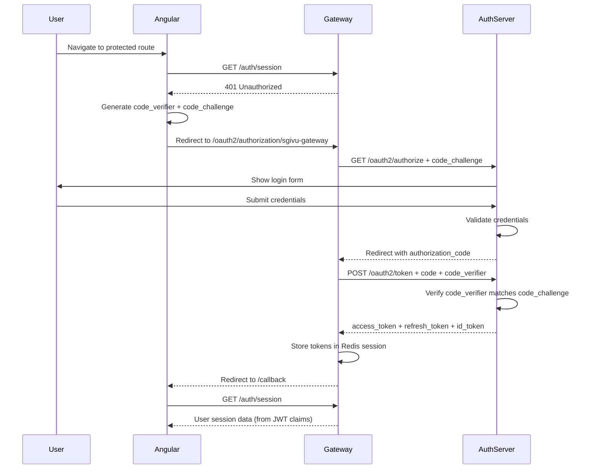

## Overview

SGIVU implements **OAuth2.1** with **OpenID Connect (OIDC)** for authentication and authorization. The `sgivu-auth` service acts as the Authorization Server, issuing JWT tokens that are validated across all microservices.

<Note>
The auth server uses Spring Authorization Server with full OIDC compliance, including support for the Authorization Code flow with PKCE (Proof Key for Code Exchange).
</Note>

## Authorization Server (sgivu-auth)

### Key Features

- **Standards Compliance**: OAuth2.1 + OIDC certified
- **Token Format**: JWT signed with RSA (JKS keystore)
- **Grant Types**: Authorization Code, Refresh Token
- **Client Authentication**: CLIENT_SECRET_BASIC
- **PKCE**: Required for all clients (enhanced security)
- **Session Storage**: PostgreSQL (JDBC sessions)

### OIDC Endpoints

| Endpoint | Purpose |
|----------|----------|
| `/.well-known/openid-configuration` | OIDC discovery metadata |
| `/oauth2/authorize` | Authorization endpoint (initiates login) |
| `/oauth2/token` | Token endpoint (exchanges code for tokens) |
| `/oauth2/jwks` | JSON Web Key Set (public keys for JWT verification) |
| `/oauth2/introspect` | Token introspection |
| `/oauth2/revoke` | Token revocation |
| `/login` | Login page (form-based authentication) |

### Registered Clients

The auth server registers OAuth2 clients on startup via `ClientRegistrationRunner`:

#### 1. sgivu-gateway (Production Client)

```java
RegisteredClient.builder()
  .clientId("sgivu-gateway")
  .clientSecret(passwordEncoder.encode(gatewayClientProperties.getSecret()))
  .clientAuthenticationMethod(ClientAuthenticationMethod.CLIENT_SECRET_BASIC)
  .authorizationGrantType(AuthorizationGrantType.AUTHORIZATION_CODE)
  .authorizationGrantType(AuthorizationGrantType.REFRESH_TOKEN)
  .redirectUri(gatewayUrl + "/login/oauth2/code/sgivu-gateway")
  .postLogoutRedirectUri(angularUrl + "/login")
  .scope(OidcScopes.OPENID)
  .scope("offline_access") // Enables refresh tokens
  .scope("api")
  .tokenSettings(tokenSettings())
  .clientSettings(ClientSettings.builder()
    .requireAuthorizationConsent(true)
    .requireProofKey(true) // PKCE required
    .build())
  .build();
```

**Token Settings:**
- Access Token TTL: **30 minutes**
- Refresh Token TTL: **30 days**
- Refresh Token Reuse: **Disabled** (rotation enabled)

#### 2. postman-client & oauth2-debugger-client

Development/testing clients with similar configuration for Postman and OAuth2 Debugger tools.

<Warning>
Default client secrets (`postman-secret`, `oauth2-debugger-secret`) are **NOT** secure for production. These clients should be disabled or reconfigured in production environments.
</Warning>

## Authorization Code Flow with PKCE

SGIVU uses the **Authorization Code flow with PKCE** for all OAuth2 clients:



### PKCE Protection

PKCE (RFC 7636) protects against authorization code interception attacks:

1. **Code Verifier**: Random 43-128 character string generated by client
2. **Code Challenge**: SHA-256 hash of code_verifier
3. **Flow**: Challenge sent with `/authorize`, verifier sent with `/token`
4. **Verification**: Auth server validates `SHA256(code_verifier) == code_challenge`

The gateway automatically handles PKCE via `OAuth2AuthorizationRequestCustomizers.withPkce()`:

```java
@Bean
ServerOAuth2AuthorizationRequestResolver authorizationRequestResolver(
    ReactiveClientRegistrationRepository clientRegistrationRepository) {
  DefaultServerOAuth2AuthorizationRequestResolver resolver =
      new DefaultServerOAuth2AuthorizationRequestResolver(clientRegistrationRepository);
  resolver.setAuthorizationRequestCustomizer(OAuth2AuthorizationRequestCustomizers.withPkce());
  return resolver;
}
```

## JWT Token Structure

### Access Token Claims

The auth server issues JWTs with custom claims via `OAuth2TokenCustomizer`:

```json
{
  "sub": "12345",
  "username": "john.doe",
  "rolesAndPermissions": [
    "ROLE_ADMIN",
    "user:read",
    "user:write",
    "vehicle:read"
  ],
  "isAdmin": true,
  "iss": "http://localhost:9000",
  "aud": "sgivu-gateway",
  "exp": 1234567890,
  "iat": 1234567800
}
```

**Key Claims:**
- `sub`: User ID (not username!)
- `username`: Login username
- `rolesAndPermissions`: Combined roles (prefixed with `ROLE_`) and permissions
- `isAdmin`: Boolean flag for admin role detection

### ID Token Claims

The OIDC ID token includes:

```json
{
  "sub": "12345",
  "userId": 12345,
  "iss": "http://localhost:9000",
  "aud": "sgivu-gateway",
  "exp": 1234567890,  // 30 days (matches refresh token TTL)
  "iat": 1234567800
}
```

<Info>
The ID token has a **30-day TTL** (same as refresh token) because it's used as `id_token_hint` during OIDC RP-Initiated Logout. Spring Security never refreshes the ID token, so it must remain valid for the session lifetime.
</Info>

## Token Signing and Validation

### Keystore Configuration

The auth server signs JWTs with an RSA key pair stored in a JKS keystore:

```yaml
sgivu:
  jwt:
    keystore:
      location: classpath:keystore.jks
      password: ${KEYSTORE_PASSWORD}
    key:
      alias: sgivu-jwt-key
      password: ${KEY_PASSWORD}
```

**Security:**
- Keystore **must NOT** be committed to Git (`.gitignore` entry required)
- Load from secret manager in production (AWS Secrets Manager, HashiCorp Vault)
- Rotate keys periodically using the `kid` (key ID) claim

### Public Key Discovery

Microservices validate JWTs by fetching the public key from the JWKS endpoint:

```java
@Bean
JwtDecoder jwtDecoder() {
  return NimbusJwtDecoder.withIssuerLocation(
      servicesProperties.getMap().get("sgivu-auth").getUrl())
    .build();
}
```

This automatically:
1. Fetches `/.well-known/openid-configuration`
2. Retrieves JWKS from `/oauth2/jwks`
3. Validates JWT signature using the public key
4. Verifies `iss` (issuer) and `exp` (expiration) claims

## Scopes and Consent

### Standard Scopes

- `openid`: Required for OIDC (triggers ID token issuance)
- `profile`: User profile claims
- `email`: Email claim
- `offline_access`: Enables refresh token issuance
- `api`: General API access

### Authorization Consent

All clients require user consent (`requireAuthorizationConsent: true`):

- Users see a consent screen listing requested scopes
- Consent is stored in the `authorization_consents` table (PostgreSQL)
- Subsequent logins skip consent if previously granted

## Session Management

The auth server uses **Spring Session JDBC** to persist sessions:

- **Table**: `SPRING_SESSION` (PostgreSQL)
- **Cookie Name**: `AUTH_SESSION`
- **Cookie Settings**: `HttpOnly=true`, `SameSite=Lax`, `Secure=false` (use `true` in production with HTTPS)
- **Max Sessions**: 5 concurrent sessions per user

```java
@Bean
CookieSerializer cookieSerializer() {
  DefaultCookieSerializer serializer = new DefaultCookieSerializer();
  serializer.setCookieName("AUTH_SESSION");
  serializer.setCookiePath("/");
  serializer.setSameSite("Lax");
  serializer.setUseHttpOnlyCookie(true);
  serializer.setUseSecureCookie(false); // Set true in production
  return serializer;
}
```

## Token Revocation

The gateway revokes tokens during logout via `TokenRevocationServerLogoutHandler`:

```java
@Bean
ServerLogoutHandler tokenRevocationLogoutHandler(
    ServerOAuth2AuthorizedClientRepository authorizedClientRepository) {
  return new TokenRevocationServerLogoutHandler(authorizedClientRepository);
}
```

This sends a revocation request to `/oauth2/revoke` before clearing the session.

## Refresh Token Flow

The gateway automatically refreshes expired access tokens using the refresh token stored in the Redis session. See [JWT Tokens](/security/jwt-tokens#token-refresh) for details.

## Production Considerations

### Issuer URL

Set the `ISSUER_URL` environment variable to match the public-facing URL:

```yaml
sgivu:
  issuer:
    url: https://api.example.com  # Must match actual hostname
```

**Why it matters:**
- JWT `iss` claim must match the issuer URL
- OIDC discovery metadata includes this URL
- Mismatches cause token validation failures

### HTTPS and Secure Cookies

In production:
- Enable `Secure` flag on cookies (`setUseSecureCookie(true)`)
- Use HTTPS for all OAuth2 endpoints
- Configure CORS to allow only trusted origins

### Client Secret Management

- Store client secrets in environment variables or secret managers
- Use strong, randomly generated secrets (not `gateway-client.secret`)
- Rotate secrets periodically

## Related Documentation

- [BFF Pattern](/security/bff-pattern) - How the gateway manages tokens for Angular
- [JWT Tokens](/security/jwt-tokens) - JWT structure and validation
- [Service Communication](/security/service-communication) - Internal service authentication
