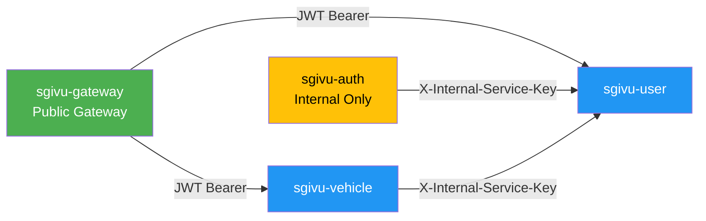

## Overview

SGIVU microservices support **two authentication mechanisms**:

1. **JWT Tokens** (from gateway/users) - Standard OAuth2 Bearer authentication
2. **Internal Service Keys** (service-to-service) - Shared secret for internal calls

This document covers the **internal service authentication** pattern using the `X-Internal-Service-Key` header.

<Note>
Internal service keys are used for **server-to-server communication** within the private network. They bypass OAuth2 flows for performance and simplicity when one microservice needs to call another.
</Note>

## Why Internal Service Keys?

### Problems with JWT-Only Authentication

If all internal calls required user JWTs:

- **Chicken-and-egg problem**: Auth service needs to call User service to validate credentials, but User service requires a JWT from Auth
- **Performance overhead**: Obtaining service-level JWTs adds latency
- **Token expiration**: Services need refresh token logic for long-running operations
- **Complexity**: OAuth2 client credentials flow adds unnecessary complexity for internal calls

### Internal Service Key Benefits

✅ **Simple**: Single shared secret per service  
✅ **Fast**: No token exchange, just header validation  
✅ **Stateless**: No token expiration to manage  
✅ **Network-isolated**: Only accessible within private network  
✅ **Flexible**: Works for background jobs, scheduled tasks, event handlers  

<Warning>
**Security Assumption:** Internal service keys rely on **network-level isolation**. Services must **NOT** be exposed to the public internet. Use AWS VPC, Kubernetes network policies, or equivalent isolation.
</Warning>

## Implementation

### Architecture



**Example:** The `sgivu-auth` service calls `sgivu-user` to validate credentials during login:

```http
POST /api/validate-credentials HTTP/1.1
Host: sgivu-user:8081
X-Internal-Service-Key: internal-secret-key-value
Content-Type: application/json

{
  "username": "john.doe",
  "password": "hashedPassword"
}
```

### Filter Implementation

Each microservice implements an `InternalServiceAuthenticationFilter` that runs **before** the JWT authentication filter:

```java
@Component
public class InternalServiceAuthenticationFilter extends OncePerRequestFilter {
  
  private static final String INTERNAL_KEY_HEADER = "X-Internal-Service-Key";
  
  private final String internalServiceKey;
  private final List<SimpleGrantedAuthority> internalAuthorities = List.of(
    new SimpleGrantedAuthority("car:read"),
    new SimpleGrantedAuthority("car:create"),
    new SimpleGrantedAuthority("car:update"),
    new SimpleGrantedAuthority("car:delete"),
    new SimpleGrantedAuthority("motorcycle:read"),
    new SimpleGrantedAuthority("motorcycle:create"),
    new SimpleGrantedAuthority("motorcycle:update"),
    new SimpleGrantedAuthority("motorcycle:delete"),
    new SimpleGrantedAuthority("vehicle:read"),
    new SimpleGrantedAuthority("vehicle:create"),
    new SimpleGrantedAuthority("vehicle:delete")
  );
  
  public InternalServiceAuthenticationFilter(
      @Value("${service.internal.secret-key}") String internalServiceKey) {
    this.internalServiceKey = internalServiceKey;
  }
  
  @Override
  protected void doFilterInternal(
      HttpServletRequest request, 
      HttpServletResponse response, 
      FilterChain filterChain) throws ServletException, IOException {
    
    if (shouldAuthenticate(request)) {
      UsernamePasswordAuthenticationToken authentication =
        new UsernamePasswordAuthenticationToken(
          "internal-service",  // Principal
          null,                // Credentials
          internalAuthorities  // Authorities
        );
      authentication.setDetails(
        new WebAuthenticationDetailsSource().buildDetails(request)
      );
      SecurityContextHolder.getContext().setAuthentication(authentication);
    }
    
    filterChain.doFilter(request, response);
  }
  
  private boolean shouldAuthenticate(HttpServletRequest request) {
    // Skip if already authenticated (JWT took precedence)
    if (SecurityContextHolder.getContext().getAuthentication() != null) {
      return false;
    }
    
    String providedKey = request.getHeader(INTERNAL_KEY_HEADER);
    return internalServiceKey.equals(providedKey);
  }
}
```

**Key Points:**

1. **Checks for existing authentication**: If JWT was already validated, skip internal key check
2. **Constant-time comparison**: Use `equals()` for timing-attack resistance (or `MessageDigest.isEqual()` for extra safety)
3. **Fixed authorities**: All internal calls get the same permissions (full CRUD)
4. **Principal name**: `"internal-service"` identifies internal calls in logs

### Security Configuration

The filter is added **before** the JWT authentication filter:

```java
@Configuration
@EnableWebSecurity
@EnableMethodSecurity
public class SecurityConfig {
  
  private final InternalServiceAuthenticationFilter internalServiceAuthenticationFilter;
  
  @Bean
  SecurityFilterChain securityFilterChain(HttpSecurity http) throws Exception {
    http
      .oauth2ResourceServer(oauth2 -> oauth2.jwt(...))
      .authorizeHttpRequests(authz -> authz
        .requestMatchers("/v1/cars/**", "/v1/motorcycles/**")
        .access(internalOrAuthenticatedAuthorizationManager())
        .anyRequest().authenticated()
      )
      .csrf(AbstractHttpConfigurer::disable)
      .addFilterBefore(
        internalServiceAuthenticationFilter, 
        BearerTokenAuthenticationFilter.class  // Run before JWT validation
      );
    
    return http.build();
  }
  
  @Bean
  AuthorizationManager<RequestAuthorizationContext> internalOrAuthenticatedAuthorizationManager() {
    AuthorizationManager<RequestAuthorizationContext> authenticatedManager =
      (authenticationSupplier, context) -> {
        Authentication authentication = authenticationSupplier.get();
        boolean isAuthenticated = authentication != null 
          && authentication.isAuthenticated() 
          && !(authentication instanceof AnonymousAuthenticationToken);
        return new AuthorizationDecision(isAuthenticated);
      };
    
    return AuthorizationManagers.anyOf(
      internalServiceAuthManager,  // Check internal key
      authenticatedManager         // OR check JWT
    );
  }
}
```

**Authorization Logic:**

- **`anyOf`**: Request is allowed if **either** internal key is valid **OR** JWT is valid
- **Filter order**: Internal filter runs first, JWT filter runs second
- **Short-circuit**: If internal key matches, JWT validation is skipped

### Authorization Manager

The `InternalServiceAuthorizationManager` checks if the current authentication is from an internal service:

```java
@Component
public class InternalServiceAuthorizationManager 
    implements AuthorizationManager<RequestAuthorizationContext> {
  
  @Override
  public AuthorizationDecision check(
      Supplier<Authentication> authentication, 
      RequestAuthorizationContext context) {
    
    Authentication auth = authentication.get();
    
    if (auth == null || !auth.isAuthenticated()) {
      return new AuthorizationDecision(false);
    }
    
    // Check if principal is "internal-service"
    boolean isInternal = "internal-service".equals(auth.getName());
    return new AuthorizationDecision(isInternal);
  }
}
```

## Configuration

### Environment Variables

**Each microservice:**

```bash
# Shared secret for internal service authentication
SERVICE_INTERNAL_SECRET_KEY=your-strong-random-secret-here
```

<Warning>
**All microservices must use the SAME secret key.** If keys mismatch, internal calls will fail with 401/403.
</Warning>

**Application YAML:**

```yaml
service:
  internal:
    secret-key: ${SERVICE_INTERNAL_SECRET_KEY}
```

### Generating a Secure Key

Use a cryptographically secure random string:

```bash
# Generate 32-byte (256-bit) random key
openssl rand -base64 32

# Or use UUID (128-bit)
uuidgen
```

**Example:**
```
SERVICE_INTERNAL_SECRET_KEY=8x9Y2mP4kL7qR3nV5wT1bN6jH0sF8dG9
```

## Use Cases

### 1. Auth Service → User Service (Credentials Validation)

**Scenario:** During login, `sgivu-auth` needs to validate user credentials.

**Call from Auth Service:**

```java
@Service
public class CredentialsValidationService {
  
  private final WebClient webClient;
  
  @Value("${service.internal.secret-key}")
  private String internalServiceKey;
  
  public Mono<CredentialsValidationResponse> validateCredentials(
      String username, String password) {
    
    return webClient.post()
      .uri(userServiceUrl + "/api/validate-credentials")
      .header("X-Internal-Service-Key", internalServiceKey)
      .bodyValue(new CredentialsValidationRequest(username, password))
      .retrieve()
      .bodyToMono(CredentialsValidationResponse.class);
  }
}
```

**Endpoint in User Service:**

```java
@RestController
public class CredentialsValidationController {
  
  @PostMapping("/api/validate-credentials")
  public CredentialsValidationResponse validate(
      @RequestBody CredentialsValidationRequest request) {
    
    // This endpoint is protected by InternalServiceAuthenticationFilter
    User user = userRepository.findByUsername(request.username())
      .orElseThrow(() -> new UsernameNotFoundException("User not found"));
    
    boolean matches = passwordEncoder.matches(
      request.password(), 
      user.getPassword()
    );
    
    if (!matches) {
      throw new BadCredentialsException("Invalid password");
    }
    
    return new CredentialsValidationResponse(
      user.getId(),
      user.getUsername(),
      user.getRoles(),
      user.getPermissions()
    );
  }
}
```

### 2. Vehicle Service → User Service (Permission Check)

**Scenario:** Vehicle service needs to check if a user has permissions to perform an action.

```java
@Service
public class VehicleService {
  
  @Value("${service.internal.secret-key}")
  private String internalServiceKey;
  
  public void deleteVehicle(Long vehicleId, Long userId) {
    // Check if user has delete permission
    UserPermissionsResponse permissions = webClient.get()
      .uri(userServiceUrl + "/api/users/" + userId + "/permissions")
      .header("X-Internal-Service-Key", internalServiceKey)
      .retrieve()
      .bodyToMono(UserPermissionsResponse.class)
      .block();
    
    if (!permissions.hasPermission("vehicle:delete")) {
      throw new AccessDeniedException("User lacks vehicle:delete permission");
    }
    
    vehicleRepository.deleteById(vehicleId);
  }
}
```

### 3. Background Jobs

**Scenario:** Scheduled task needs to call microservices without a user context.

```java
@Scheduled(cron = "0 0 2 * * *")  // Daily at 2 AM
public void cleanupExpiredVehicles() {
  webClient.delete()
    .uri(vehicleServiceUrl + "/api/vehicles/expired")
    .header("X-Internal-Service-Key", internalServiceKey)
    .retrieve()
    .bodyToMono(Void.class)
    .block();
}
```

## Security Considerations

### Network Isolation

<Warning>
**Critical:** Internal endpoints **MUST NOT** be exposed to the public internet.
</Warning>

**AWS Deployment:**
```
┌─────────────────────────────────────┐
│  Public Subnet (DMZ)                │
│  - ALB (HTTPS only)                 │
│  - Nginx (reverse proxy)            │
│    └──> Routes to Gateway only      │
└─────────────────────────────────────┘
              │
              ▼
┌─────────────────────────────────────┐
│  Private Subnet                     │
│  - sgivu-gateway (public routes)    │
│  - sgivu-auth (internal only)       │
│  - sgivu-user (internal only)       │
│  - sgivu-vehicle (internal only)    │
│    └──> All accessible via          │
│         X-Internal-Service-Key      │
└─────────────────────────────────────┘
```

**Kubernetes NetworkPolicies:**

```yaml
apiVersion: networking.k8s.io/v1
kind: NetworkPolicy
metadata:
  name: allow-internal-only
spec:
  podSelector:
    matchLabels:
      app: sgivu-user
  policyTypes:
  - Ingress
  ingress:
  - from:
    - podSelector:
        matchLabels:
          app: sgivu-auth
    - podSelector:
        matchLabels:
          app: sgivu-vehicle
    - podSelector:
        matchLabels:
          app: sgivu-gateway
```

### Secret Management

**Development:**
```bash
# .env file (never commit)
SERVICE_INTERNAL_SECRET_KEY=dev-secret-key-12345
```

**Production:**

- **AWS Secrets Manager**: Fetch secret on startup
- **HashiCorp Vault**: Dynamic secrets with rotation
- **Kubernetes Secrets**: Inject as environment variable

**Example (AWS Secrets Manager):**

```java
@Configuration
public class SecretsConfig {
  
  @Bean
  public String internalServiceKey(SecretsManagerClient secretsClient) {
    GetSecretValueRequest request = GetSecretValueRequest.builder()
      .secretId("sgivu/internal-service-key")
      .build();
    
    GetSecretValueResponse response = secretsClient.getSecretValue(request);
    return response.secretString();
  }
}
```

### Key Rotation

**Zero-downtime rotation process:**

1. **Add new key**: Update secret manager with `NEW_SERVICE_INTERNAL_SECRET_KEY`
2. **Update services**: Deploy services with dual-key support:
   ```java
   private boolean isValidKey(String providedKey) {
     return internalServiceKey.equals(providedKey) 
         || newInternalServiceKey.equals(providedKey);
   }
   ```
3. **Update callers**: Deploy calling services with new key
4. **Remove old key**: After all services use new key, remove old key support

**Rotation Frequency:** Every 90 days (or when compromised)

### Rate Limiting

Add rate limiting for internal endpoints to prevent abuse:

```java
@Component
public class InternalServiceRateLimitFilter extends OncePerRequestFilter {
  
  private final RateLimiter rateLimiter = RateLimiter.create(100.0); // 100 req/sec
  
  @Override
  protected void doFilterInternal(...) {
    if ("internal-service".equals(authentication.getName())) {
      if (!rateLimiter.tryAcquire()) {
        response.setStatus(HttpStatus.TOO_MANY_REQUESTS.value());
        return;
      }
    }
    filterChain.doFilter(request, response);
  }
}
```

### Logging and Monitoring

Log all internal service calls for audit:

```java
private boolean shouldAuthenticate(HttpServletRequest request) {
  String providedKey = request.getHeader(INTERNAL_KEY_HEADER);
  boolean isValid = internalServiceKey.equals(providedKey);
  
  if (providedKey != null) {
    if (isValid) {
      log.info("Internal service authenticated [path={}, ip={}]",
        request.getRequestURI(),
        request.getRemoteAddr());
    } else {
      log.warn("Invalid internal service key [path={}, ip={}]",
        request.getRequestURI(),
        request.getRemoteAddr());
    }
  }
  
  return isValid;
}
```

**CloudWatch/Prometheus Metrics:**
```
internal_service_requests_total{service="sgivu-user",status="success"} 1523
internal_service_requests_total{service="sgivu-user",status="invalid_key"} 3
```

## Comparison: Internal Key vs JWT

| Aspect | Internal Service Key | JWT Bearer Token |
|--------|---------------------|------------------|
| **Use Case** | Service-to-service (internal) | User-to-service (external) |
| **Network** | Private network only | Can traverse public network |
| **Expiration** | No expiration (rotated manually) | 30 minutes (auto-refresh) |
| **Permissions** | Fixed (all CRUD) | User-specific (claims) |
| **Performance** | Fast (simple string comparison) | Slower (crypto validation) |
| **Audit** | Service identity only | User + service identity |
| **Revocation** | Rotate key (impacts all services) | Revoke individual token |

**When to use each:**

- **Internal Key**: `sgivu-auth` → `sgivu-user`, background jobs, scheduled tasks
- **JWT**: Gateway → microservices (user requests), external API calls

## Alternative: Mutual TLS (mTLS)

For **zero-trust architectures**, consider replacing internal keys with **mTLS**:

**Benefits:**
- Cryptographic service identity (client certificates)
- Network-layer security (TLS 1.3)
- Automatic key rotation (certificate expiration)

**Drawbacks:**
- Complex certificate management (CA, CRLs)
- Higher operational overhead
- Requires Kubernetes/Istio service mesh or manual cert distribution

**When to use mTLS:**
- Multi-tenant environments
- Compliance requirements (PCI-DSS, HIPAA)
- Services in different VPCs/clusters

## Related Documentation

- [OAuth2 & OIDC](/security/oauth2-oidc) - External authentication flows
- [JWT Tokens](/security/jwt-tokens) - User authentication with JWTs
- [BFF Pattern](/security/bff-pattern) - How the gateway manages user sessions
